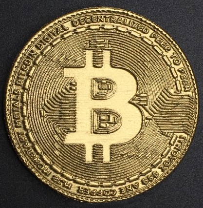

# Posición de impresión

En muchas ocasiones resulta crítica la posición en la que debemos poner nuestro diseño para que se imprima

Ejemplo: El [superconocido cráneo de T-rex](https://www.thingiverse.com/thing:308335)

[Modelo Fillenium Malcon](https://www.thingiverse.com/thing:919475)

[Modelo bitcoin](https://www.myminifactory.com/es/object/3d-print-bitcoin-49537)

[Vídeo: Eligiendo la mejor posición para imprimir un modelo](https://drive.google.com/file/d/1uLW3H38QPAgmt0qR4t5A_r703Tpa82o0/view?usp=sharing)

