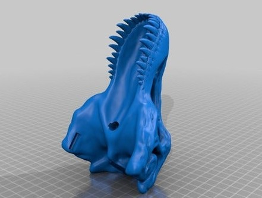
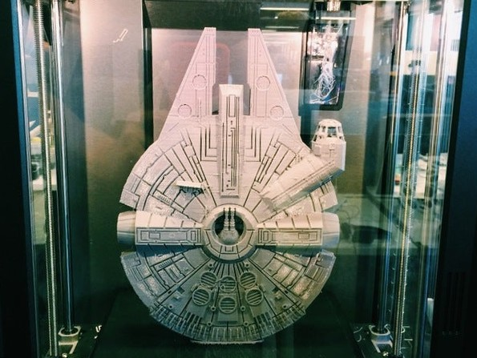

# Posición de impresión

Es algo evidente que el resultado de la impresión depende mucho de la orientación en la que coloquemos el modelo al laminar. 

Ya vimos que en nuestras impresoras la resolución en los ejes X e Y viene dada por el tamaño del agujero de la boquilla, unos 0.4mm. Como vemos es bastante más baja que la que podemos alcanzar en el eje Z, donde podemos llegar a 0.05mm. Así los detalles serán mejores en altura que en las otras direcciones.

Es por tanto que en muchas ocasiones la posición resulta crítica para conseguir la calidad que esperamos.

En otras ocasiones podemos reducir bastante la cantidad de material de soporte necesario dependiendo de la orientación, bien por la estructura de la pieza o porque el diseñador lo pensó así.

Esto ocurre en el [superconocido cráneo de T-rex](https://www.thingiverse.com/thing:308335) donde se puede imprimir sin soporte usando esta orientación, en contra de lo que nos dice nuestra intuición:

Veamos algunos ejemplos en los que la calidad mejora al imprimir las piezas en vertical: 

Por ejemplo en este modelo muy conocido [Fillenium Malcon](https://www.thingiverse.com/thing:919475) (nótese el nombre aparentemente disléxico para evitar reclamaciones).

O este modelo de moneda [bitcoin](https://www.myminifactory.com/es/object/3d-print-bitcoin-49537), que también da mejor resultado al imprimirlo en vertical

En el caso de que vayamos a imprimir una pieza alta en posición vertical, es mejor asegurarnos de tener una buena adherencia añadiendo un elemento como falda o brim para garantizar una mayor superficie de agarre con la base.

[Vídeo: Eligiendo la mejor posición para imprimir un modelo](https://drive.google.com/file/d/1uLW3H38QPAgmt0qR4t5A_r703Tpa82o0/view?usp=sharing)

