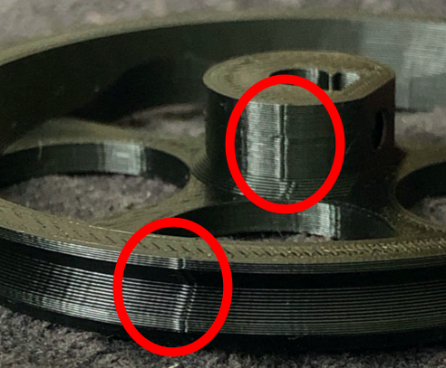
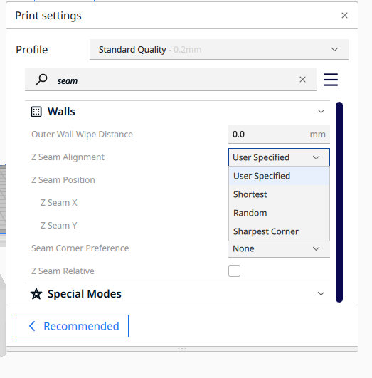
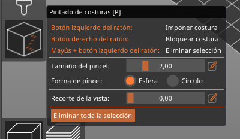

# Costuras

Ese defecto que se ve es lo que se denomina z seam (costura en el eje z) y son los puntos donde empieza y termina cada capa. Normalmente los laminadores aciertan a esconderlos, por ejemplo en una arista, pero en ocasiones quedan muy visibles.

En cura, podemos escoger que sea aleatorio modificando el parámetro "z seam aligment" a Random 

De esta manera se disimula completamente.

En PrusaSlicer tenemos un panel para poder "pintar" dónde queremos las costuras

