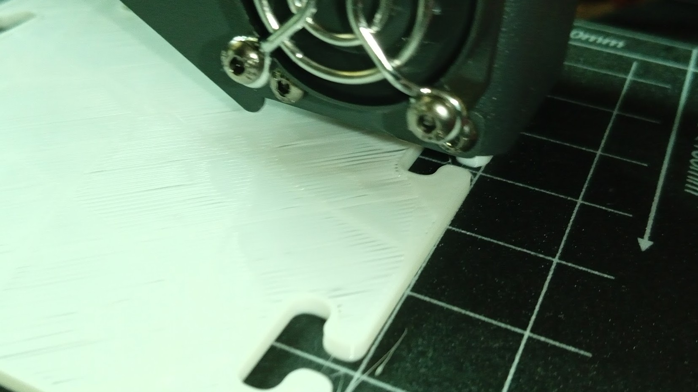

# Proceso Impresión pieza

Ya hemos visto que una pieza impresa tiene diferentes tipos de extrusiones de filamento. 

En cada una de ellas se utilizan diferentes velocidades y volumen de plástico para conseguir el acabado adecuado. También en algunas se enciende el ventilador de capa para conseguir un enfriado rápido

Vamos a ver algunos de estos tipos:

1. **Primera capa**: para conseguir una buena adherencia las primeras capas se imprimen aplanadas, como podemos ver en la siguiente imagen:

2. **Perímetro**: es la parte más externa de cada capa, y al ser exterior se imprime despacio para conseguir un buen acabado
3. **Perímetros primera capa**: mucho más planos que las restantes capas para asegurar la adherencia. Si vemos que sale redondita tenemos que recalibrar.

4. **Capas inferiores**: son las capas de abajo de la pieza que se ven desde el exterior. Hay que aclarar que podemos tener capas inferiores a cualquier altura, con tal de que sean visibles. Así la parte de abajo del tablero de una mesa sería una capa inferior. Al ser vistas se imprimen más despacio para que tengan un buen acabado. Se suelen poner varias para dar fuerza y más calidad.
5. **Relleno**: forma el interior de las piezas y suele tener una estructura determinada para ahorrar plástico y tiempo de impresión.

6. **Voladizo**: es cuando una caba no está totalmente sobre la capa anterior. Normalmente se suele medir por el ángulo que forma con la vertical. Por encima de 50º se recomienda usar soporte.

7. **Puente**: Una capa horizontal que no tiene capa debajo. Se imprime deprisa y con el ventilador de capa a tope para enfriarlo rápidamente.

8. **Capas superiores**: Son las capas visibles desde arriba. Del mismo modo que las inferiores no son las más altas, sino que pueden estar en cualquier parte. Se imprimen varias para conseguir un mejor acabado. Los laminadores usan varios tipos de capas superiores para aunar velocidad y calidad. En la imagen anterior vemos la primera de las capas superiores que va haciendo "puentes" sobre el relleno. En la primera capa superior se pueden ver imperfecciones

Terminada la primera capa superior se imprime la 2ª con mucha mejor calidad, muy lisita.

En algunos casos, si la pieza es más compleja se pueden necesitar más capas superiores.

## Conceptos

Vamos a aprovechar para repasar algunos conceptos:

**Soporte**: Material extra que se genera al laminar para que las capas superiores de voladizos o puentes tengan donde sustentarse.

* Material extra generado por el laminador para mejorar la adherencia de la pieza con la base. Puede ser de diferentes tipos:
    * **Falda**: se genera unos perímetros extra en la primera capa. Podemos configurar el número de perímetros.
        
    * **Brim/Balsa**: genera varias capas extras de perímetros para mejorar la adherencia. Podemos configurar cuántas capas y el tamaño de éstas.
    

* **Retracción**: es el movimiento para sacar el filamento que se hace para evitar goteos o que se generen hilos con el movimiento del extrusor cuando se mueve de un sitio a otro. Para configurar la extrusión tenemos como parámetro la **distancia** en mm de retracción de filamento y la **velocidad** a la que se hace este movimiento. Si no tenemos bien configurada la retracción se generarán hilos como los de la imagen:

* **Expansión horizontal**: Algunos materiales plásticos tienen la tendencia a expandirse al enfriarse con lo que el tamaño de la pieza impresa es levemente superior al que ha calculado el software laminar. El parámetro se llama **Expansión XY** o **Expansión horizontal** suele ser del orden de 0.1mm y puede tener signo positivo, en cuyo caso hacemos la pieza más gruesa o negativo (el más habitual) en el que rebajamos el tamaño de la pieza.

## Capas superiores e inferiores

En este vídeo vamos a ver problemas cuando no tenemos suficientes capas superiores e inferiores.

[Vídeo: Calidad de las capas superiores](https://drive.google.com/file/d/162UCOAhJpprlGXIQ7bDplaLy4nFF1YWB/view?usp=sharing)

