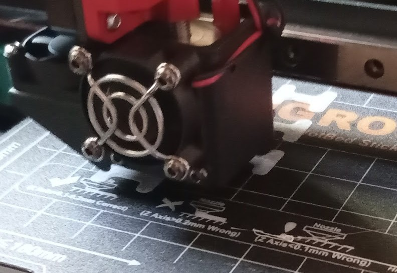

# Proceso Impresión pieza

Perímetros primera capa: mucho más planos que las restantes capas para asegurar la adherencia. Si vemos que sale redondita tenemos que recalibrar

1. Capas inferiores
1. Perímetros
1. Relleno
1. Capas superiores

Distintas velocidades

Primera capa muy lisita 

Perímetros y relleno

Primera capa superior

Terminada la primera capa superior

Segunda capa superior, muy lisita. En este caso habíamos configurado sólo 2 capas superiores

## Conceptos

Retracción
Soporte
adherenica:
* Borde
* Falda
* Brim

Perímetros

capa superior
capa inferior

puentes, arcos, agujeros, voladizos,

## Capas superiores e inferiores

[Vídeo: Calidad de las capas superiores](https://drive.google.com/file/d/162UCOAhJpprlGXIQ7bDplaLy4nFF1YWB/view?usp=sharing)

