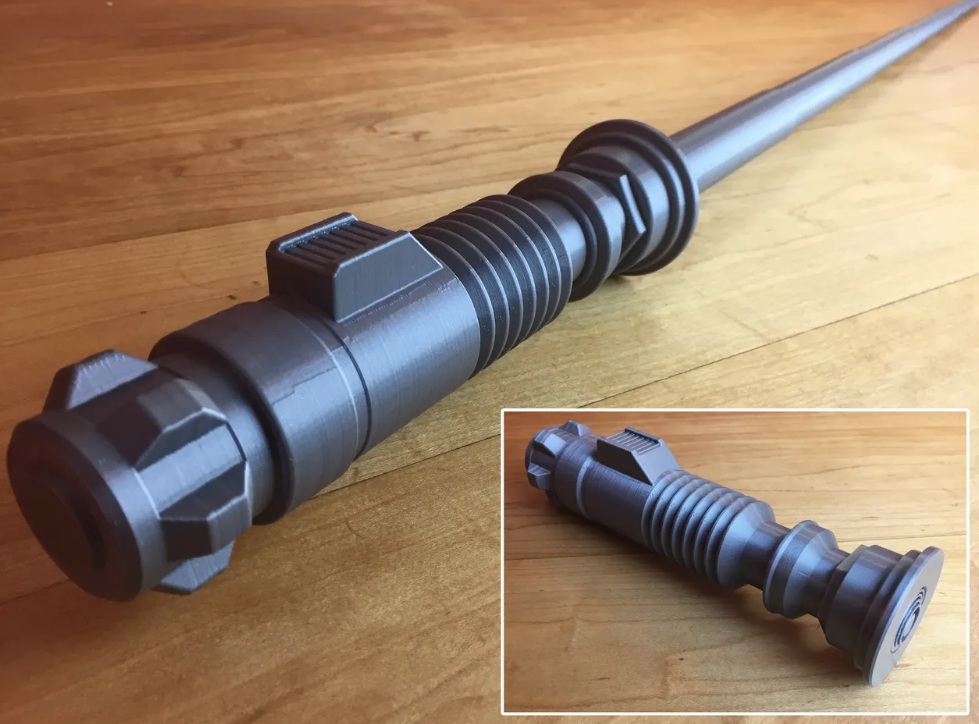
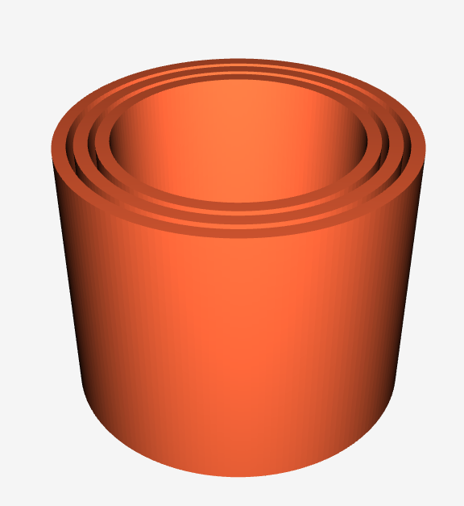
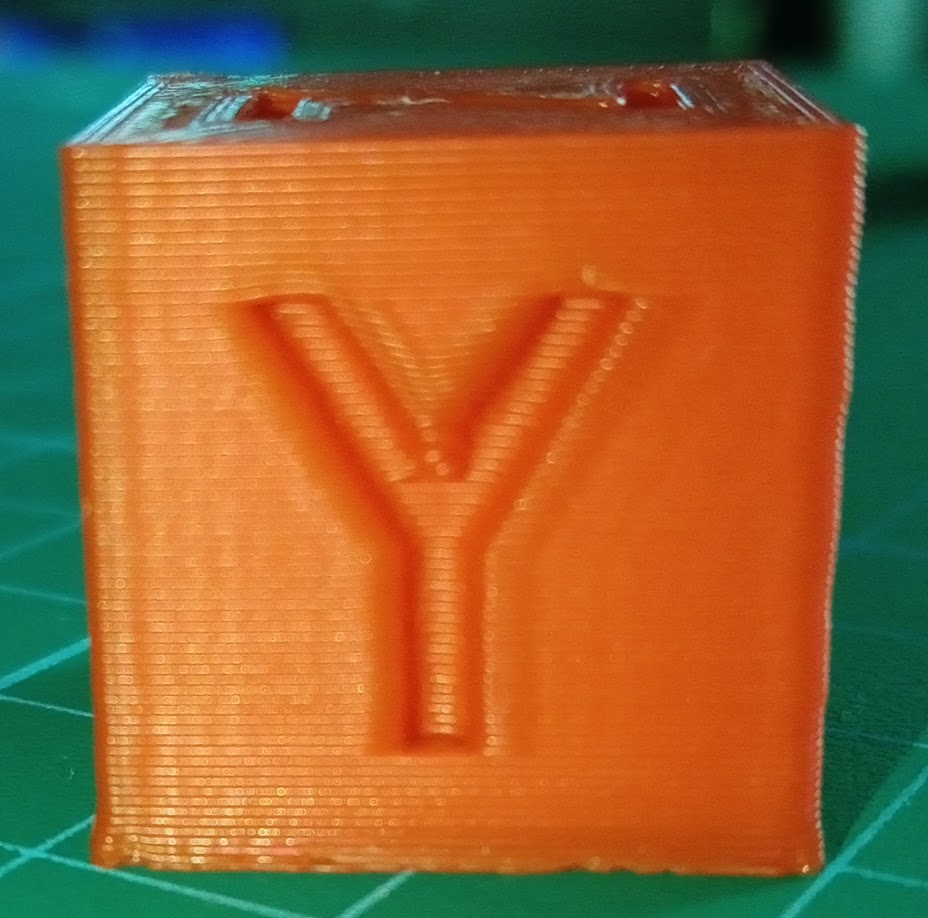
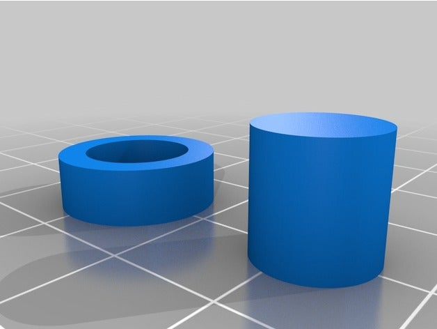

## Ajuste preciso de tamaños

Para imprimir algunas piezas como este [modelo de sable de luz retráctil](https://www.prusaprinters.org/prints/3720-collapsing-lightsaber-print-in-place) es necesario tener muy bien configurada nuestra impresora, para que las partes internas no se peguen entre sí

Muchos de estos modelos suelen incluir una pequeña pieza para probar si la calidad configurada es la adecuada y en caso contrario para facilitarnos la calibración:

Lo más habitual es que las diferentes partes se peguen (cosa que no debía pasar). En este caso el parámetro que tenemos que ajustar es la **Expansión XY** o **Expansión horizontal** dándole un valor negativo. Empezaremos por -0.1 e iremos subiendo si es necesario.

Si usamos Ultimaker Cura también podemos ajustar los parámetros **Coast & Wipe** que hacen que el extrusor deje de expulsar filamento cuando va a terminar una capa, evitando una gotita que a veces se deposita y en estos modelos pegaría las capas.

Otro defecto que puede arruinarnos piezas como estas es la **Pata de elefante**. Con este simpático nombre se conoce al defecto producido por el mayor tamaño horizontal de las primeras capas. También podemos añadir un valor negativo para evitarlo.

[Vídeo: 6.3.1 Calibrando el ajuste preciso de nuestras piezas](https://drive.google.com/file/d/1RTPo6TdN_naA-_xl8wADUSUXCJqhU05H/view?usp=sharing)

Si nuestro modelo no lo incluye, siempre podemos utilizar este [Modelo para ajuste de la expansión horizontal](https://www.thingiverse.com/thing:1662342):

[Vídeo 6.3.2 Ajuste preciso del tamaño de las piezas impresas](https://drive.google.com/file/d/13N2INAVBdvr5COEcwiM88UvchtBp5-u5/view?usp=sharing)

