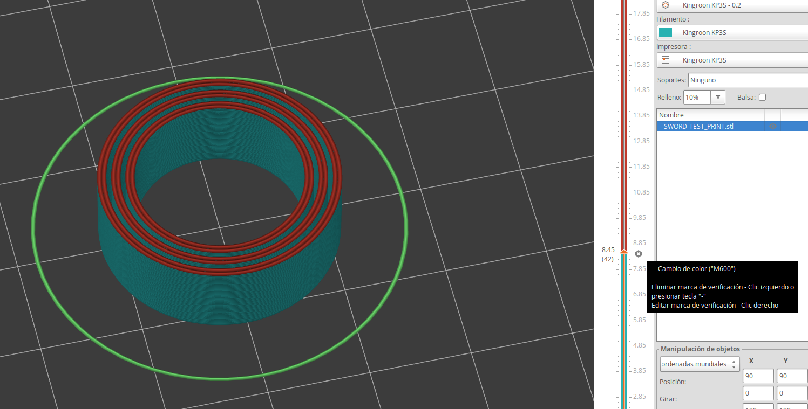
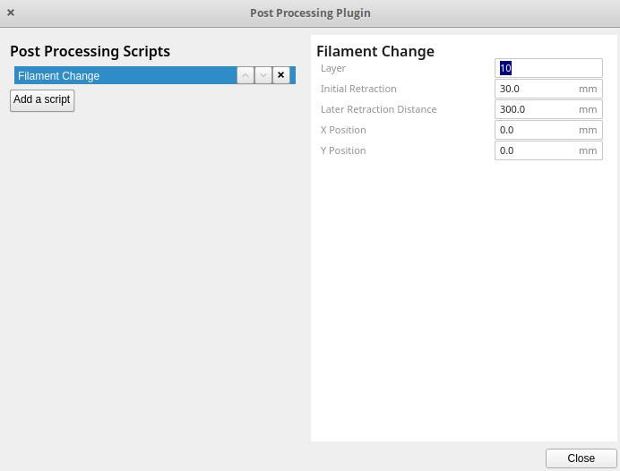

## Impresión multicolor con 1 extrusor

Sabemos que existen impresoras capaces de usar varios filamentos al mismo tiempo usando diferentes técnicas. En las impresoras con un único extrusor también podemos hacer piezas multicolor pero han de ser zonas limitadas a capas.

El mecanismo básicamente es programar una pausa en la capa en la que queremos cambiar el filamento y hacer este cambio:

* Configuramos la Pausa a la altura/capa que queramos
* Comprobamos que la temperatura sea la adecuada
* Sacamos el filamento
* Configuramos  la temperatura del nuevo filamento 
* Verificamos si la base se sigue calentando
* Introducimos el nuevo filamento.
* Purgamos el fusor, para que no queden restos del anterior, haciendo que se extruya suficiente cantidad para que se vea el nuevo color limpiamente. A veces se puede producir mezcla de colores, si uno es muy fuerte y otro claro, por poco que quede en el extrusor puede teñir al claro, por eso hay que extruir una buena cantidad tras hacer el cambio, hasta que veamos que sale limpio al 100%, y aún así puede pasar como a tí que quede algún resto en el interior.
* Pulsamos la opción de Continuar para siga la impresión

Para programar esa pausa en Prusa Slicer, sólo tenemos que pulsar en la vista de capas en el signo "+" en la columna adecuada de la columna de capas:

En Ultimaker Cura utilizaremos la extensión de postprocesado de GCODE, donde encontramos diferentes extensiones que nos permiten hacerlo como "Change filament", "Pause at height" o "Search & replace" donde configuraremos la altura y las características de la pausa.

¡¡CUIDADO con CURA !! Las opciones de post-procesado en Cura se quedan aunque cambiemos de pieza.

En el siguiente vídeo vamos a ver cómo hacerlo con Prusa Slicer y con Ultimaker Cura. 

[Vídeo: 6.3.3 Laminando piezas con cambios de filamento para impresiones multicolor](https://drive.google.com/file/d/1-aN93x5C3Frgwkc-X4B1nJvS4mTC_YK0/view?usp=sharing)

En el siguiente vídeo vamos a ver el resultado en una impresora Prusa i3

[Vídeo: 6.3.3 Impresión Bicolor usando una impresora Prus i3](https://drive.google.com/file/d/1V0dzk11nCsnFNNcTsqKjmfbra4ERZgcV/view?usp=sharing)

Ahora vamos a hacerlo en una impresora KingRoon KP3s

[Vídeo: 6.3.3 Impresión Bicolor en una impresora KingRoon KP3s](https://drive.google.com/file/d/1hy--Nog416CY-J9A9p0LUG5Kx6jSNwP6/view?usp=sharing)

