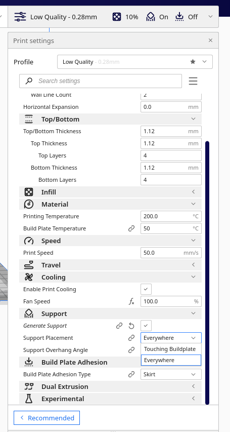
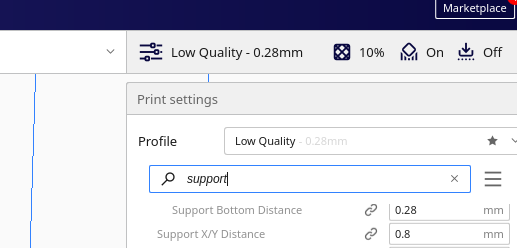
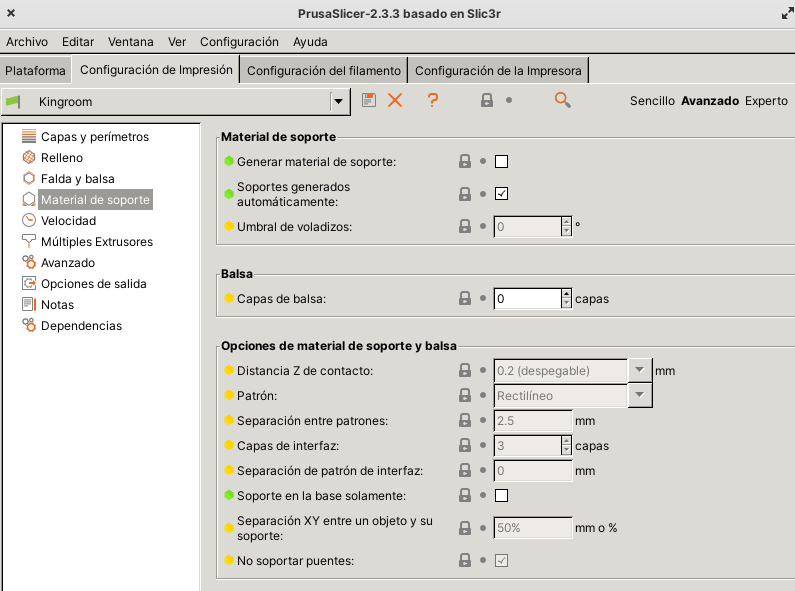

Soportes tipo árbol

Mostrar imagen de cómo se ven desde prusaslicer

Cómo retirar los soportes

Ajuste de la distancia Pieza Soporte

el primero paso es cambiar la opción de soporte a "solo la base"

Si así no te sirve podemos activar la opción de modificar la distancia entre el soporte y la pieza: abriendo las opciones avanzadas

y cambiamos la opción "Support X/Y Distance", al aumentarla se separa el soporte

En Prusa Slicer podemos cambiarlo en el modo Avanzado con distancia X/Y  y Distancia Z

