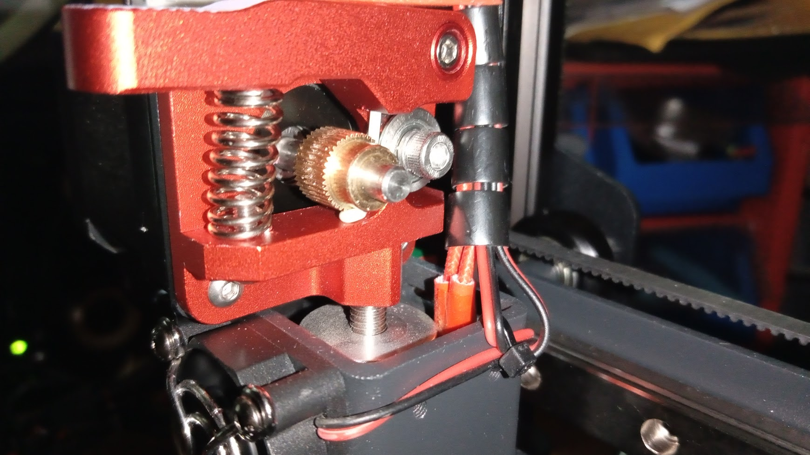
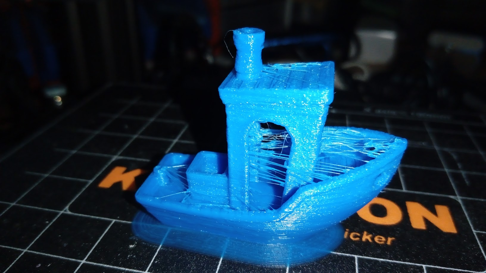
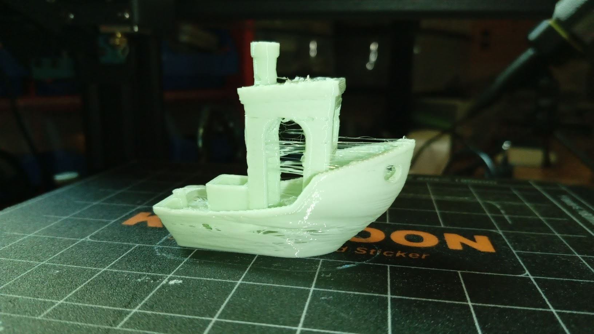

# Filamentos flexibles

Suelen tener muy buena adherencia

Ejemplo de problema en el extrusor:

Tenemos que:

* Respetar la temperatura que nos recomienda el fabricante
* Bajar la temperatura de la base, los flexibles suelen tener muy buena adherencia 
* Quitar la retracción

* Bajar la velocidad

Ahora, para conseguir una pieza flexible deberíamos de cambiar la estructura interna de la pieza:

* Mejor usar rellenos concéntricos
* Si queremos una pieza muy flexible podemos bajar el % de relleno
* Si es necesario subir el número de perímetros

Probar y practicar hasta conseguir buenos resultados.

[Vídeo: 6.5 Impresión con filamentos flexibles](https://drive.google.com/file/d/1Ykfg0oj2AGIQlMxDbTwp5gqTsEDiSCaz/view?usp=sharing)

