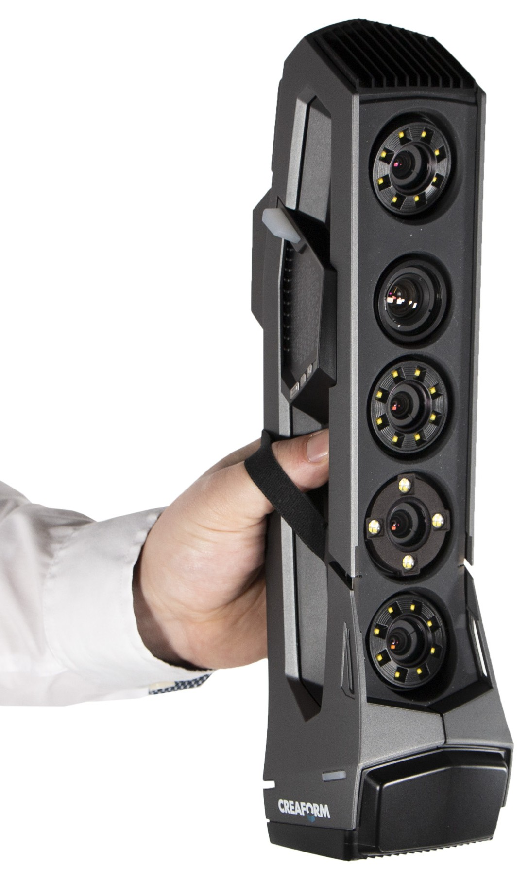

## Escaneado 3D

Escanner 3D DIY

Escanner profesional

[Tutorial Escaneado 3D con móvil](https://bitfab.io/es/blog/escanear-3d-movil/)

[Fotogrametría I](https://blog.prusaprinters.org/photogrammetry-3d-scanning-just-phone-camera/)

[Fotogrametría I (vídeo)](https://www.youtube.com/watch?v=ye-C-OOFsX8)

[Fotogrametría II](https://blog.prusaprinters.org/photogrammetry-2-3d-scanning-simpler-better-than-ever/)

[Fotogrametría II (vídeo)](https://www.youtube.com/watch?v=1D0EhSi-vvc)

[Tutorial](https://descubrearduino.com/que-es-el-escaneo-3d-definicion-ventajas-y-usos/)