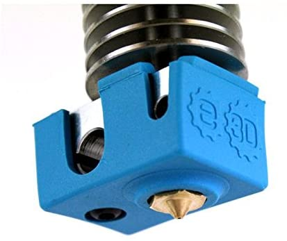
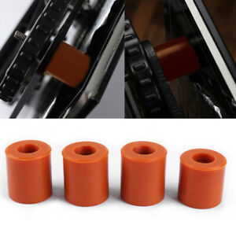
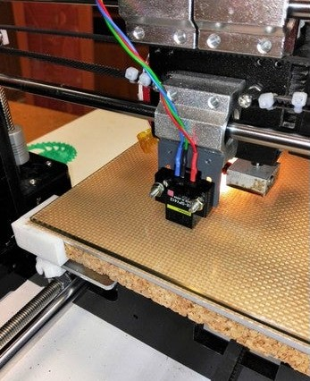
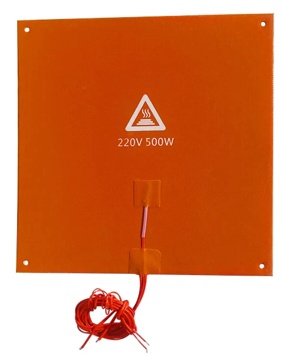

## Mejoras en el hardware

Otra forma de mejorar los resultados de nuestras impresiones es mejorando el funcionamiento de la impresora. 

Una mejor mecánica (husillos, rodamientos, patines,...) o electrónica (motores, drivers, ...) puede generar mejores piezas

### Mejorando el aislamiento térmico

Una capucha de silicona mejora el aislamiento del bloque calefactor, haciéndolo más eficiente al evitar fugas de calor

Unos acoples de silicona para la base caliente también eliminan fugas de calor hacia la estructura haciendo más eficiente el calentamiento.

De la misma manera añadir una plancha de corcho bajo la base calienta también mejorará la eficiencia

Existen también elementos calefactores para la base con un lado recubierto con aislante de silicona

También se pueden usar acoples para los motores con muelles para reducción del ruido y de vibraciones.

### Reduciendo el ruido

Otro problema es el ruido que podemos reducir usando ventiladores más silenciosos, y por tanto caros y drivers más silenciosos y eficientes.

