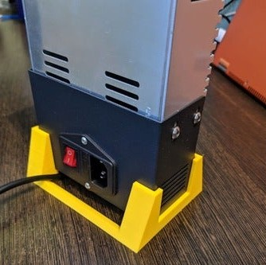
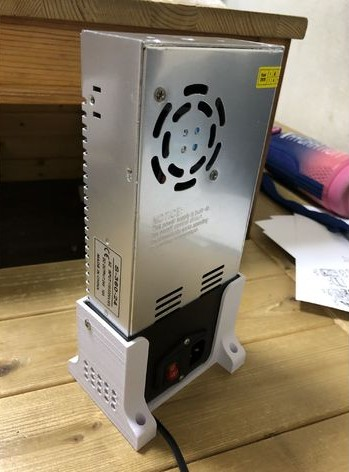
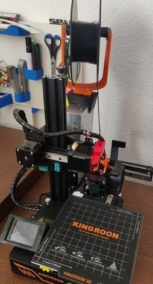
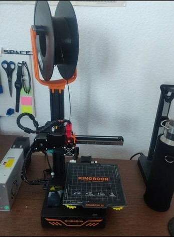
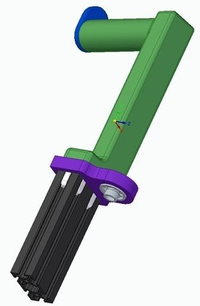

## Mejoras para la KingRoon KP3s

Vamos a ver algunas mejoras para la impresora Kingroon KP3s:

[Vídeo: Mejoras a la impresora 3D Kingroon KP3s](https://drive.google.com/file/d/1d5AG7C9Szh7qv4jQMEm5M2TaZuDrhjaH/view?usp=sharing)

Un [soporte para la fuente de alimentación](https://www.thingiverse.com/thing:4740318) que nos va a ahorra espacio al permitirnos ponerla en posición vertical:

Hay varias versiones como este otro [soportes para fuente de alimentación vertical](https://www.thingiverse.com/thing:4671163)

También podemos hacer que ocupe menos espacio si usamos este [Portarollo sobre la fuente de alimentación](https://www.thingiverse.com/thing:4611818)

O este otro [Portarollo sobre el eje Z](https://www.thingiverse.com/thing:4600120)

O este otro [Portarollos sobre el eje Z](https://www.thingiverse.com/thing:4783450) que además evita pandeo en el husillo 

