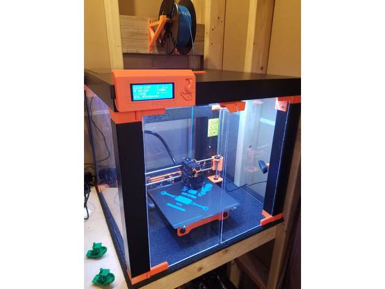

## Cajas/Cierres para impresoras

Otra forma de mejorar el resultado es encerrar nuestra impresora en una caja:

* La temperatura será más estable
* Menos ruído
* Evitaremos que nadie toque.

Un ejemplo es el [Proyecto PrusaLack](https://blog.prusaprinters.org/cheap-simple-3d-printer-enclosure_7785/) pensado para la impresora de Prusa Original

El diseño de las [piezas está en thingiverse](https://www.thingiverse.com/thing:2982392) y hay adaptaciones para diferentes impresoras con diferentes tamaños

También hay diferentes diseños de puertas, unos más simples que otros según la necesidad.
