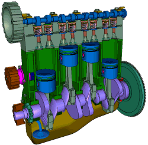
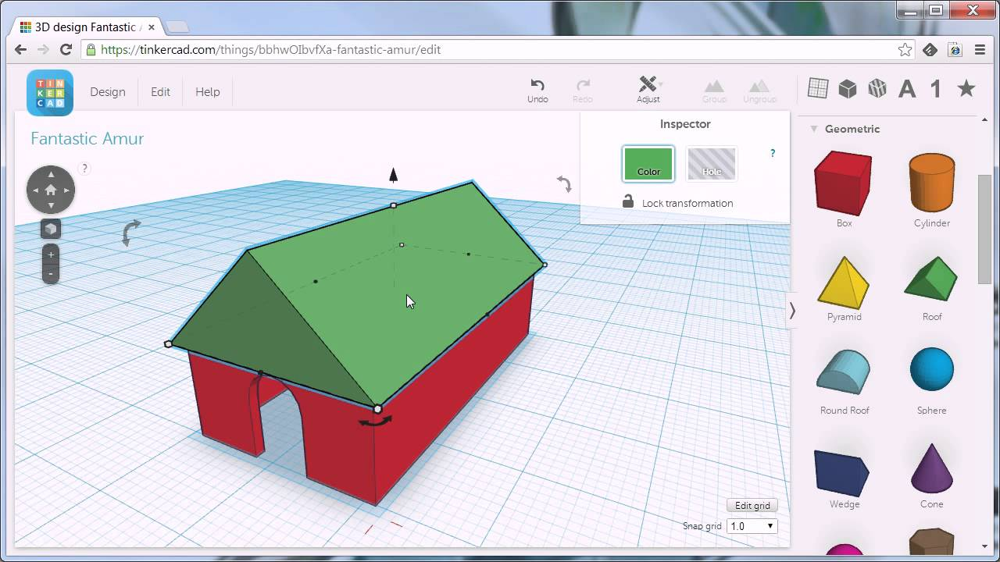

#### Herramientas de diseño en 3D

* [FreeCad](http://www.freecadweb.org/)
 [Tutorial rápido](http://spainlabs.com/wiki/index.php?title=Tutorial_r%C3%A1pido_de_FreeCad) [videotutoriales](http://www.iearobotics.com/wiki/index.php?title=Dise%C3%B1o_de_piezas_con_Freecad) ([detalles](./Freecad.md))

* [123d skult](http://www.mibqyyo.com/articulos/2015/03/11/aprender-diseno-3d-123d-sculpt/#/vanilla/discussion/embed/?vanilla_discussion_id=0)

* [123d Design](http://www.mibqyyo.com/articulos/2015/02/02/aprendiendo-diseno-3d-123d-design/#/vanilla/discussion/embed/?vanilla_discussion_id=0)

* [SketchUp](https://my.sketchup.com/app) ([detalles](./SketchUp.md))

  

* [Tinkercad](http://Tinkercad.com) ([detalles](./Tinkdercad.md))

  

* [Blender](https://www.blender.org/) ([Detalles](./Blender.md))

* [OpenSCad](http://www.openscad.org/) ([Tutoriales](http://www.iearobotics.com/wiki/index.php?title=Obijuan_Academy#Tutoriales_Openscad))

  

### Complementos

* [netfabb](http://www.netfabb.com/engine_ultimaker.php) Software de corrección de errores
