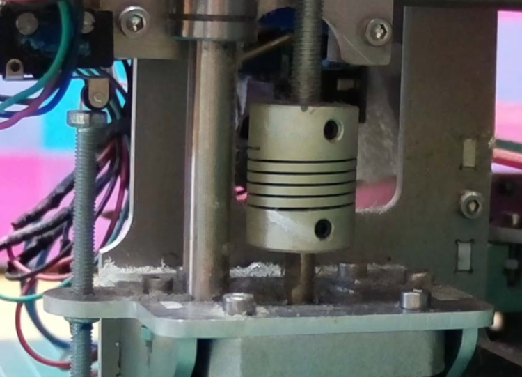
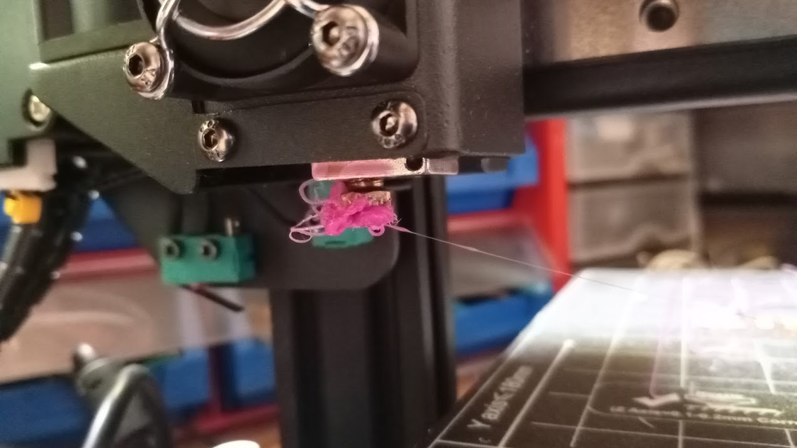
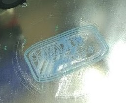
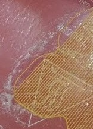
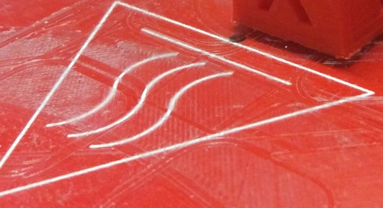

# Limpieza

El uso continuado de la impresora, sobre todo por el rozamiento del filamento con el extrusor y por los pequeños fragmentos que se separan de las piezas, hace necesaria una limpieza frecuente.

Si además usamos laca o la grasa de los husillos o rodamientos hace que esta suciedad se acumule. Como vemos en las siguientes imágenes, esta suciedad se acumula en los motores:

También en los rodamientos y en los patines, al mezclarse el polvo con la grasa de estos componentes.

## Limpieza de la boquilla

Tras una impresión es frecuente que queden restos de filamento en el exterior de la boquilla. Podemos hacer una limpieza del exterior de la boquilla en caliente y usando un cepillo metálico pero de cerdas finas. Personalmente uso estropajo metálico doméstico de tipo "nanas"

## Limpieza del extrusor

En los engranajes del extrusor se acumulan restos de filamento que debemos limpiar de vez en cuando. 

[Vídeo: Aprovechando un cambio de filamento para hacer limpieza](https://drive.google.com/file/d/1Iwclf34BvFaDn8aw9BqJuZZHvk7NSwyw/view?usp=sharing)

## Limpieza de la superficie de impresión

La base sobre la que imprimimos es un componente fundamental para conseguir impresiones de buena calidad

* Debemos mantenerla limpia para evitar que los restos de anteriores impresiones se adhieran a las nuevas piezas. 
* Hay que tener cuidado al limpiarla para evitar ralladuras.
* En el cristal/espejo quedan muchos restos, sobre todo si usamos laca. Es conveniente tener un mínimo de limpieza pero no es necesario limpiarla cada vez.
* Un exceso de laca va a dejar restos en nuestras piezas.

## Limpieza de los ventiladores

Los ventiladores son sin duda el componente donde más suciedad se acumula, debido al flujo permanente de aire que soporta. Por eso es importante limpiarlos con frecuencia, para evitar que pierdan eficacia y generan más ruido.

Una falta de rendimiento de los ventiladores puede dar lugar a calentamiento de la electrónica o de otros componentes.

