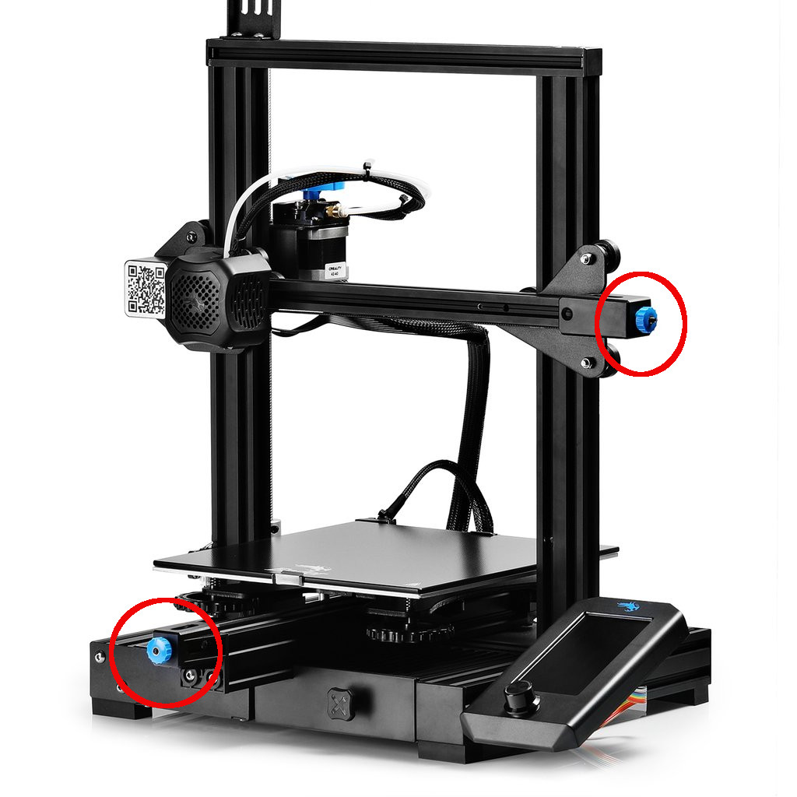

# Mantenimiento básico de una impresora 3D

Además de las tareas de limpieza que ya hemos comentado conviene que apliquemos ciertos cuidados al resto de componentes mecánicos/eléctricos:

* **Engrasado**: debemos mantener bien engrasadas las piezas que se rozan mecánicamente, como por ejemplo las varillas, poleas, rodamientos. Podemos usar grasa de litio o grasa con base de silicona.
* **Ajustes**: de las partes mecánicas, la vibración y los movimientos hacen que se vayan aflojando lo que nos va a obligar a hacer un **apretado de tornillos y tuercas**, sin que llegue a ser excesivo.
* **Tensión de las correas**: con el paso del tiempo las correas suelen perder tensión, pudiendo llegar a producirse saltos, perdiendo precisión. La mayoría de las impresoras incluyen unos mecanismos en el extremo de los ejes X eY con los que podemos retensarlas.

 

## Cuidados del filamento

La humedad es una de las causas más frecuentes de deterioro de los filamentos. Por eso, cuando no los vayamos a usar debemos guardar los filamentos en bolsas para evitar que cojan humedad, lo que los haría más frágiles y más difíciles de imprimir.

Muchos fabricantes incluyen una bolsa con cierre tipo Zip para guardar las bobinas con más garantías.

Esto no quiere decir que cada noche tengamos que guardar el filamento que no estemos usando, pero sí cuando no lo vayamos a usar durante unos días.

El filamento debe ser un poco flexible, si lo encontramos quebradizo suele ser porque ya he perdido parte de sus características. De todas formas puedes probar a imprimir con él.

