## [Octoprint](https://octoprint.org/)


[Octoprint](https://octoprint.org/) es un software de control remoto y gestión de impresoras 3D. Podemos acceder al mismo vía Web, tras instalarlo en un equipo. Es OpenSource, creado por [Gina Häußge](https://www.linkedin.com/in/ginahaeussge) y a día de hoy va por la versión 1.6 con un ritmo de actualización y mantenimiento excelente. Es muy utilizado, tanto por usuarios particulares como por empresas. 

De hecho Prusa Research tiene una versión propia de octoprint (PrusaPrint) preparado para sus impresoras que se conecta directamente a la placa de la impresora.

Con Octoprint podemos enviar directamente a la impresora las tareas de impresión, encendiéndola o apagándola cuando sea necesario. En todo momento podemos ver el estado y si tenemos cámara podremos ver la impresora en funcionamiento.

[](https://drive.google.com/file/d/1eOzrLx6OO-g5A0Qr4-20FlsI6U4BntKe/view?usp=sharing)


[Vídeo: 7.5.1 Controla remotamente tu impresora 3D con Octoprint](https://drive.google.com/file/d/1eOzrLx6OO-g5A0Qr4-20FlsI6U4BntKe/view?usp=sharing)

Podemos utilizar cualquier ordenador, pero en mi caso usaré una Raspberry:


[](https://drive.google.com/file/d/1cDrPsKW89hJVOzRsAyKaIQNjr-PQkUWg/view?usp=sharing)

[Vídeo: 7.5.2 Instalación de Octoprint](https://drive.google.com/file/d/1cDrPsKW89hJVOzRsAyKaIQNjr-PQkUWg/view?usp=sharing)

Desde la [página de descargas de octoprint](https://octoprint.org/download/) podemos descargar la aplicación para instalarla en nuestro sistema operativo o como en nuestro caso una imagen completa que flashearemos en una tarjeta SD utilizando [Balena etcher](https://www.balena.io/etcher/) 

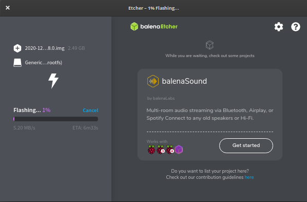

También hay instrucciones para la [instalación en Windows](https://community.octoprint.org/t/setting-up-octoprint-on-windows/383/1) o [en Mac](https://community.octoprint.org/t/setting-up-octoprint-on-macos/13425)

Octoprint no incorpora un interface gráfico, sino que está pensado para que lo controlemos remotamente vía web. Por ello antes de arrancarlo vamos a configurar el acceso a red. Podemos usar Wifi o un cable ethernet. En mi caso voy a usar wifi. 

Para configurarlo, antes de colocarla en la Raspberry accedemos a la tarjeta SD y editaremos el fichero "/boot/octopi-wpa-supplicant.txt" donde descomentamos y rellenaremos los datos de acceso a nuestro wifi

```sh
# WPA/WPA2 secured
network={
  ssid="MiRedWifi"
  psk="miContraseñaWifi"
}

```

Ahora al arrancar se conectará y nos mostrará en pantalla la ip


También podemos acceder desde el nombre [http://octopi.local](http://octopi.local)

### Primera configuración

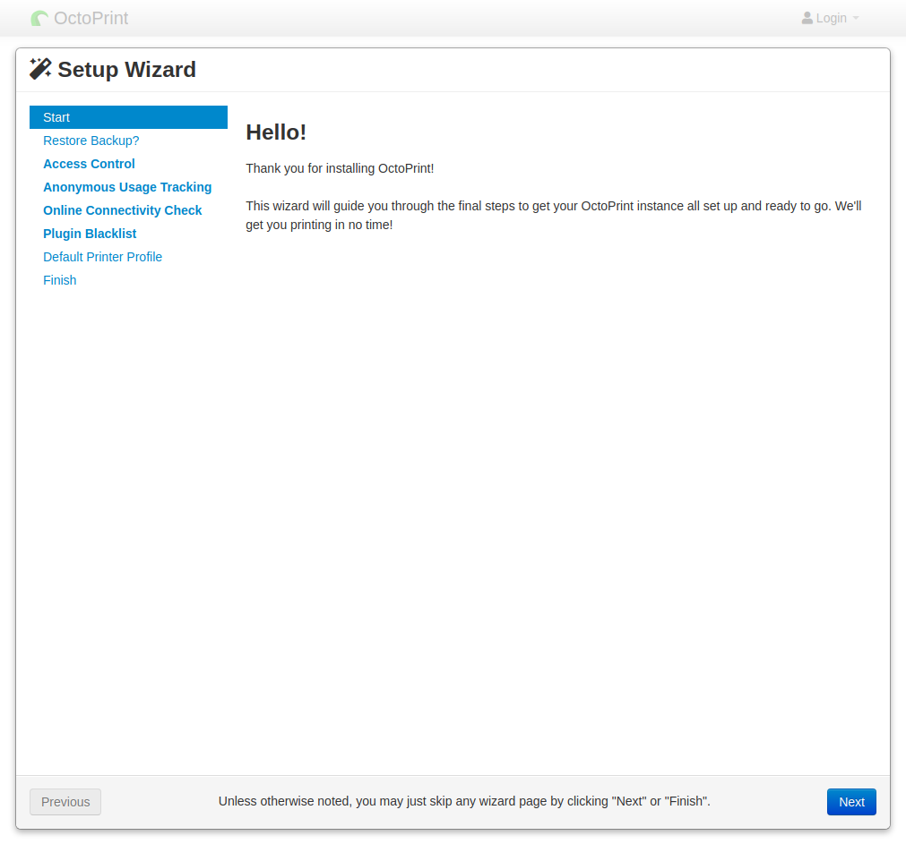

* Como en toda Raspberry tendremos acceso desde la consola y ssh con pi/raspberry
* Entramos a [http://octopi.local](http://octopi.local)
* Establecemos un usuario y contraseña para acceso vía Web
* Activamos si queremos las estadísticas anónimas de uso 
* Configuramos la frecuencia de la comprobación de conectividad y actualizaciones.
* Configuramos también si queremos usar la Lista negra de plugins, para evitar que se instalen plugins no autorizados.
* Por último configuramos nuestra impresora:
  * Nombre del perfil
  * Forma: cuadrada o circular
  * Origen (Home)
  * Si tiene base caliente
  * Si está dentro de una caja
  * Tamaño de impresión
  * En la pestaña de "Axes" configuramos las velocidades, que dejaremos por defecto
  * En la pestaña "Hotend & extruder" configuramos el nº de extrusores y el tamaño de la boquilla.
* Por último nos muestra las recomendaciones de uso: 
  * Por seguridad no deberías dejar desatendida nuestra impresora mientras imprime.
  * No debemos dejar accesible el servidor desde internet.

Si nos gusta el Octoprint y lo encontramos práctico podemos [donar al proyecto](https://octoprint.org/support-octoprint/)

[](https://drive.google.com/file/d/1TYERg2G9pl07Pw9yLjpjs26UdX1ees23/view?usp=sharing)

[Vídeo: 7.5.3 Configuración de Octoprint](https://drive.google.com/file/d/1TYERg2G9pl07Pw9yLjpjs26UdX1ees23/view?usp=sharing)

### Uso de octoprint

Cuando accedemos a octoprint [http://octopi.local](http://octopi.local), nos podemos encontrar que tenemos actualizaciones pendientes. Pulsamos para actualizar y tras la descarga, se instalan y se reinicia con la nueva versión.


Al acceder a Octoprint nos encontramos con la pantalla de inicio de sesión:
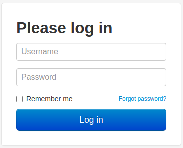

Arriba tenemos la barra de iconos donde tenemos acceso rápido a alguna funcionalidad


* Icono de apagado, desde el que podemos apagar o reiniciar Octoprint


* Icono de configuración,  que nos lleva a toda la configuración de Octoprint y de los plugins instalados
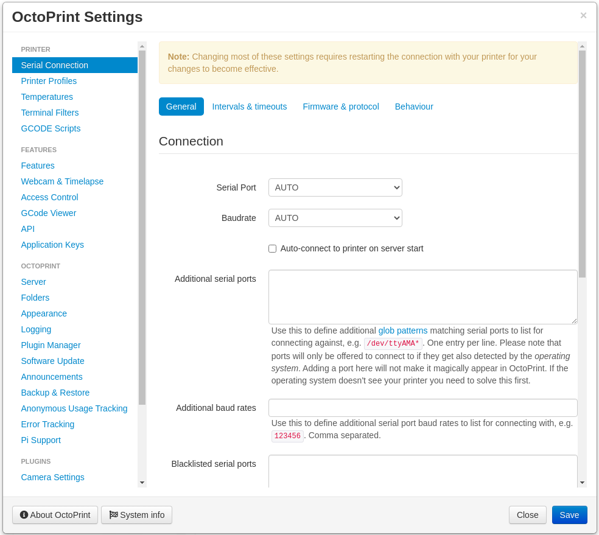

* Iconos de diversos plugin, como por ejemplo el de encender o apagar la impresora del plugin OctoRelay 

En el lateral vemos el estado conexión y de la impresora:
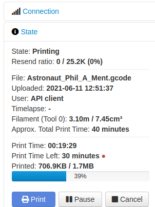


En la parte central vemos que aparecen varias pestañas:

* Temperatura: donde veremos las temperaturas actuales y las previstas, y desde la que podemos precalentar la impresora según las configuraciones guardadas.
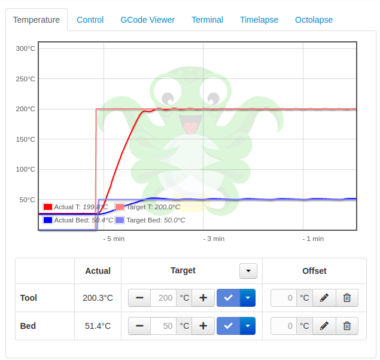
* Control: con una imagen central de la cámara en tiempo real
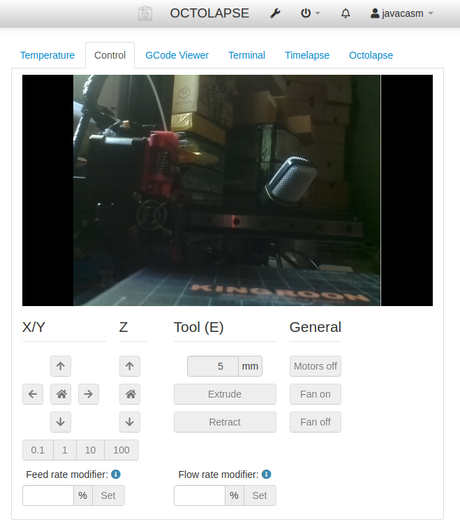
Y si la impresora está conectada y encendida veremos controles para mover el extrusor en los distintos ejes y activar o apagar el ventilador
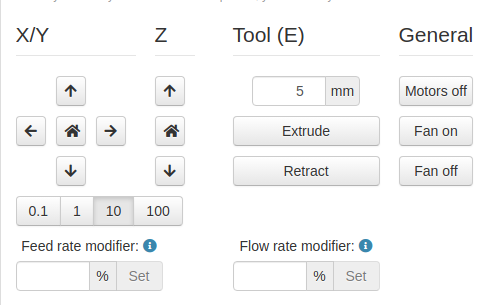

* Pestaña GCode viewer: nos permite ver la capa que se está imprimiendo en cada momento:
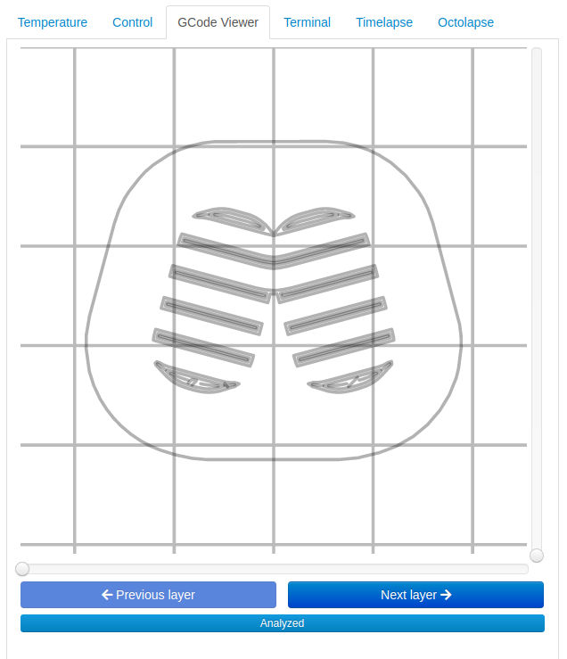
O movernos por las distintas capas
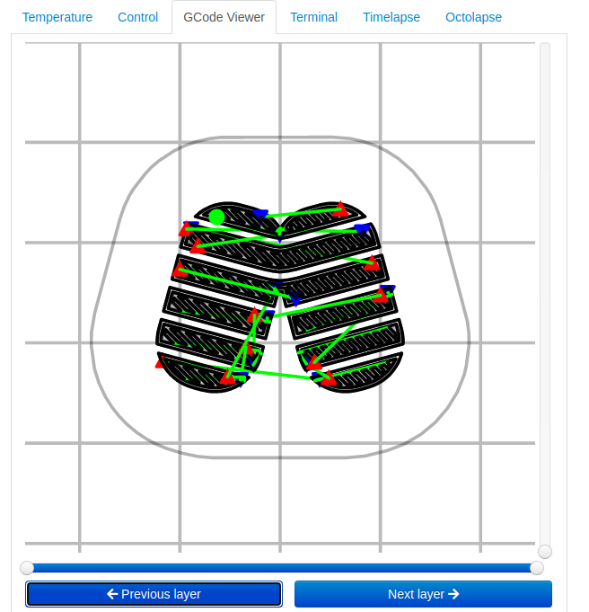

* Pestaña de terminal: desde donde podemos ver la comunicación entre la impresora y Octoprint en tiempo real
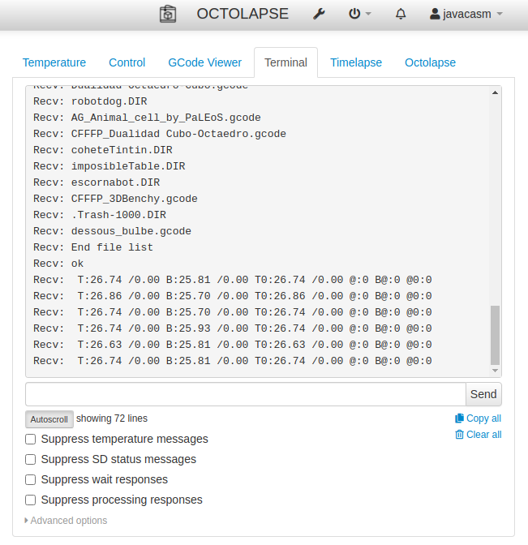
Podemos filtrar algunos mensajes repetitivos, como por ejemplo los de las temperaturas.

* Pestaña de TimeLapse: donde podemos configurar si queremos hacer un timelapse de la impresión, que puede ser por tiempo o por capas. Desde esta pestaña podremos descargar también los video resultados.
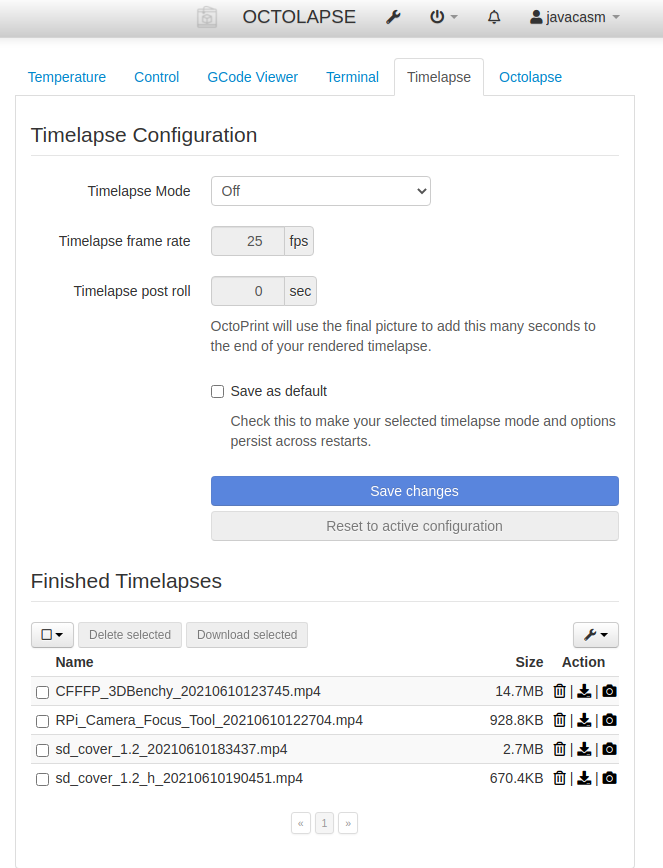
Luego instalaremos un plugin específico para hacer timelapse, que nos da más opciones y mejor resultado: Optolapse.

Algunos plugins, como Optolapse añaden sus propias pestañas.

[](https://drive.google.com/file/d/1BdoytSLZ999gpGVPQkE3kl4Mt_ms2yx5/view?usp=sharing)


### Enviando una tarea de impresión desde PrusaSlicer

Podemos añadir la configuración de acceso de octoprint a nuestra impresora en PrusaSlicer, de manera que podemos enviar el laminado directamente a la impresora para que se imprima:

1. Añadimos la ip o la url
2. Añadimos la clave del API  que sacamos de la configuración de Octoprint:
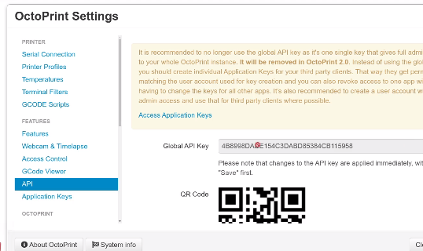
3. Probamos el test de conexión
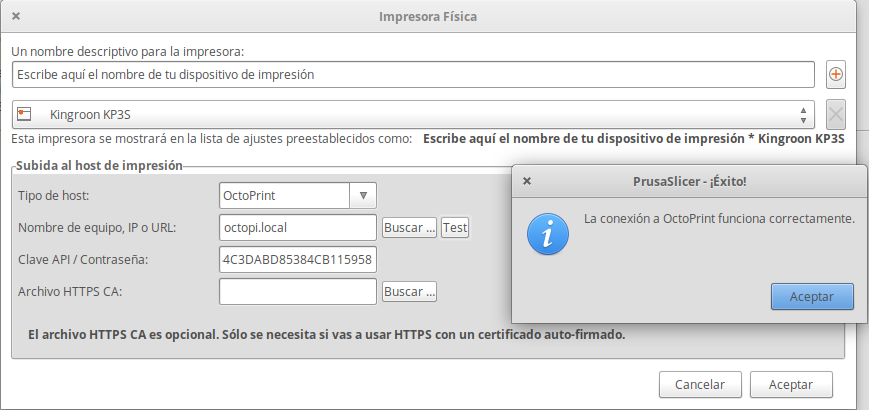
4. Al laminar tendremos una nueva opción   de enviar el resultado a la impresora
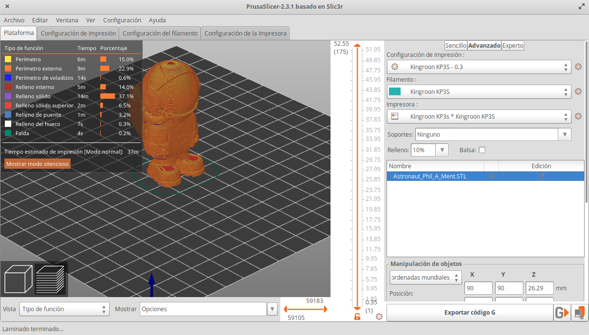
5. Seleccionamos el nombre y si queremos que se imprima directamente
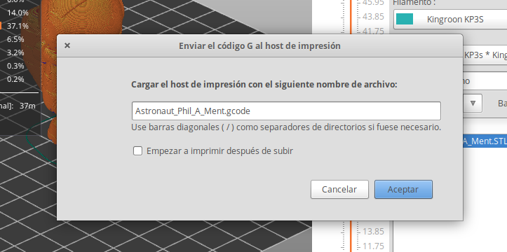

### Enviando un trabajo de impresión desde Cura

1. Abrimos la pestaña Complementos del "MarketPlace"
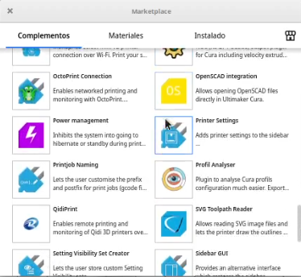
2. Buscamos "Octoprint Connection
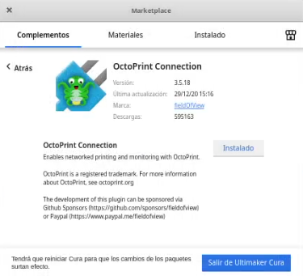
3. Los instalamos y reiniciamos Cura
4. Al entrar en la Administración de impresoras, veremos que tenemos una nueva opción de "Conectar con Octoprint"
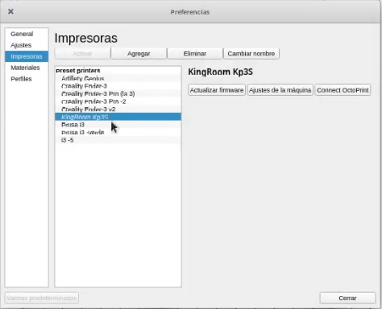
5. Lo configuramos con la ip y el API Key
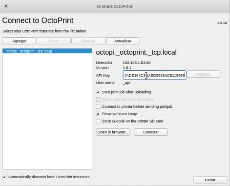
6. Tras laminar un modelo podremos enviar el GCode resultante a Octoprint
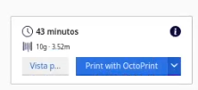
7. Cuando lo hayamos enviamos podremos supervisar la impresión desde Cura:
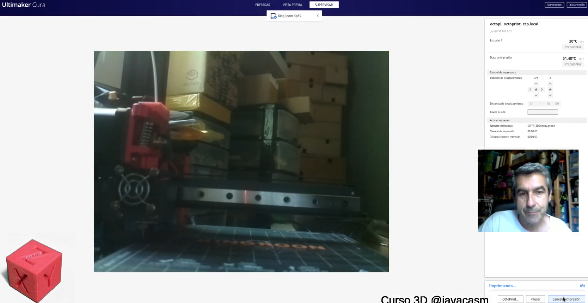


[](https://drive.google.com/file/d/1Gi0RAhKxMukLrV8tp_tb82EZBg6veBb7/view?usp=sharing)


[Vídeo: 7.5.5 Configuración e Impresión con OctoPrint desde laminadores](https://drive.google.com/file/d/1Gi0RAhKxMukLrV8tp_tb82EZBg6veBb7/view?usp=sharing)

### Vigilando el funcionamiento de la impresora

Mientras se está imprimiendo:

* Vemos el estado de impresión, el % y el tiempo restante


* Vemos los ficheros de la tarjeta SD, con el último fichero enviado:


También podemos imprimir desde la web, bien cualquiera de los ficheros GCode que tenemos en la tarjeta o uno nuevo que podemos subir.

### Plugins

Una características muy interesante de Octoprint es que al ser modular permite que otros desarrolladores creen complementos (plugin) para añadir funcionalidad.

Podemos añadir o quitar, activar o desactivar plugins desde el Gestors de Plugins de la configuración de Octoprint:
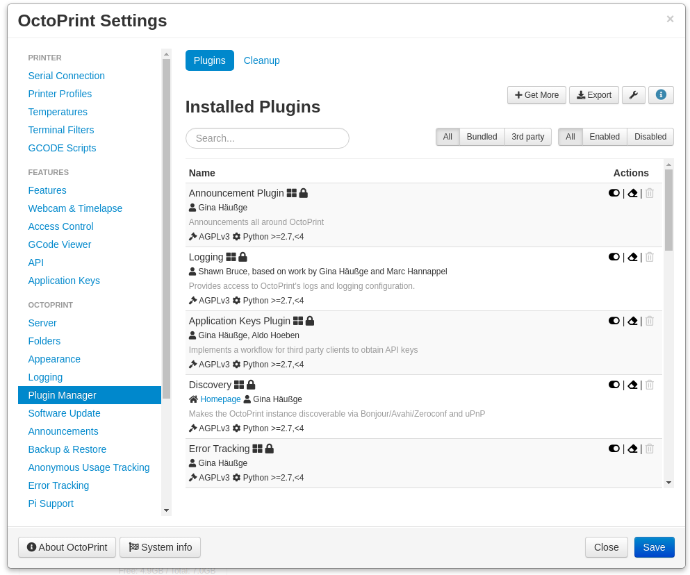
Donde veremos los instalados y desde donde podemos añadir nuevos.

Normalmente cada plugin añade nuevas opciones de configuración.

Veamos algunos de ellos

#### OctoRelay

[OctoRelay](https://plugins.octoprint.org/plugins/octorelay/) nos permite encender y apagar nuestra impresora remotamente cuando enviemos algo para imprimir. Para ello usaremos un cable de alimentación con un relé como interruptor que encendemos desde la Raspberry.

Al instalar el plugin OptoRelay nos aparece icono en la cabecera por cada relé que incluyamos:


En la configuración del plugin seleccionaremos el pin GPIO con el que controlaremos el relé

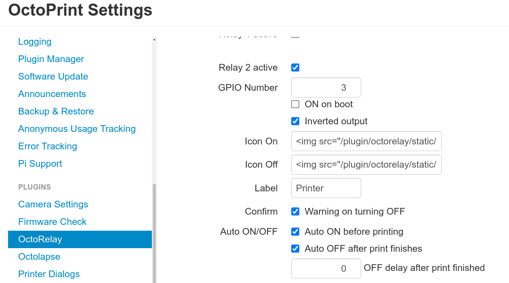

Además del control manual, en la configuración podemos hacer que al enviar un nuevo trabajo de impresión se encienda la impresora y se apague al terminar.

Podemos controlar hasta 8 relés con otros tantos dispositivos: distintas luces, extractor, ....

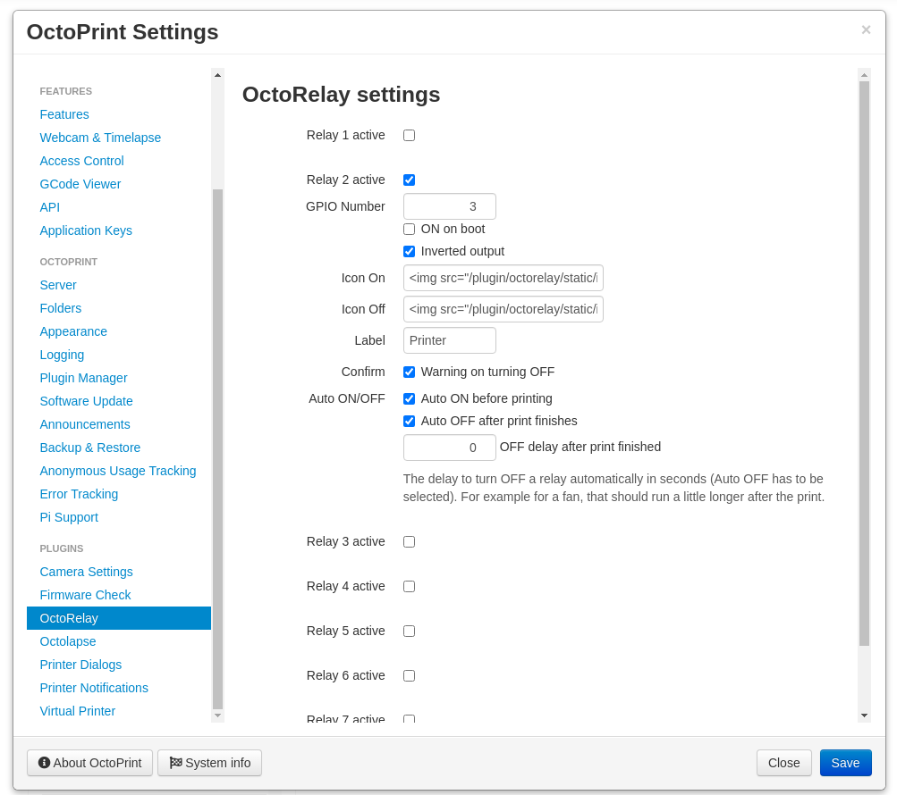

Para usarlo necesitamos crear un cable de alimentación especial para la impresora, al que cortamos uno de los hilos para colocar un relé que actúe como interruptor electrónico:

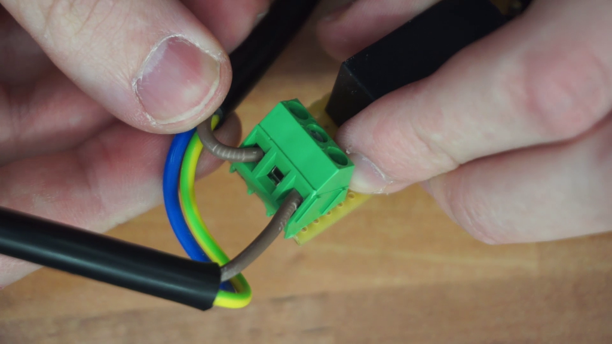

También conectamos los pines de control del relé a la Raspberry:

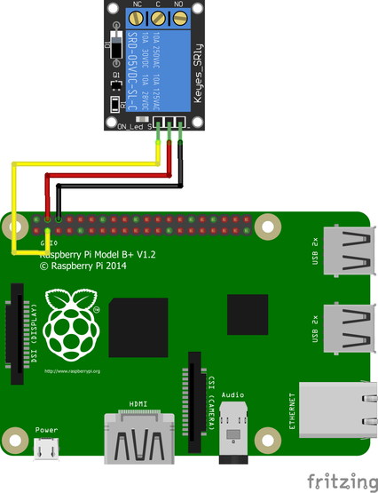

Podemos incluir el relé con el cable en una caja:

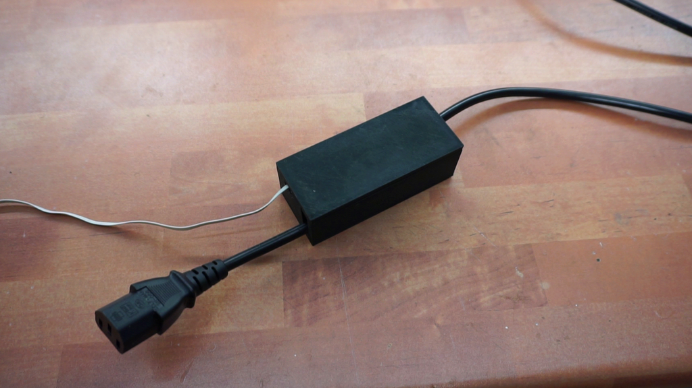

(Imágenes cortesía de la documentación de OptoRelay)

### Camera settings

Se trata de un plugin que nos ofrece un configuracón más detallada de la cámara.

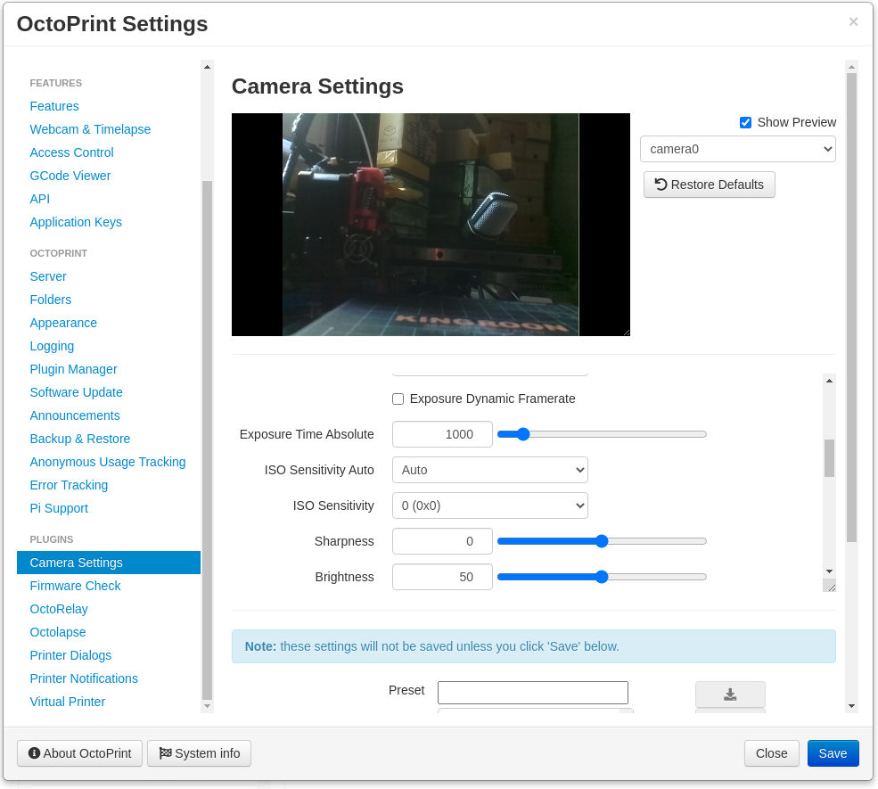

### Optolapse

Este plugin nos proporciona muchas opciones diferentes para hacer los timelapse, pudiendo decidir por ejemplo si el extrusor debe ir a alguna posición concreta a la hora de tomar la imagen instantánea:
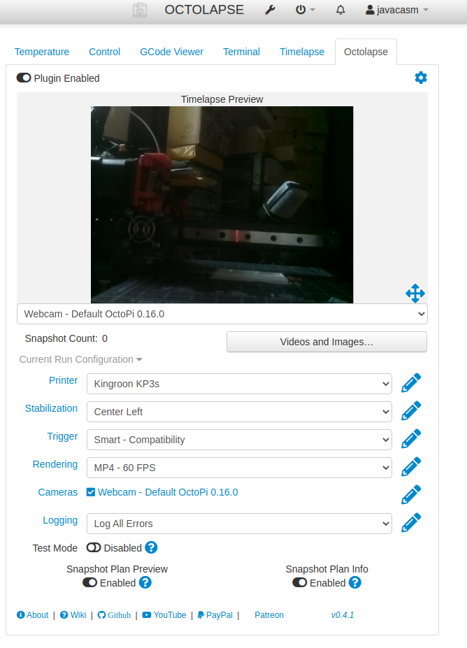
Tiene una detallada configuración:
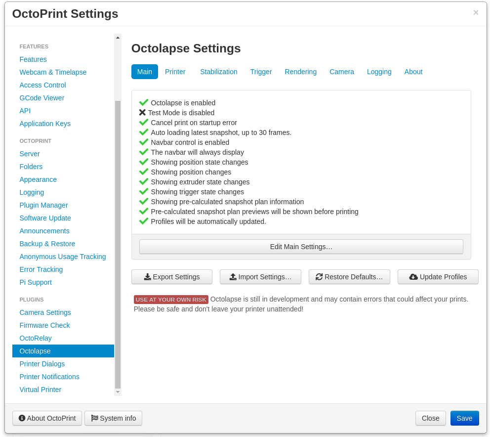
Cuando está funcionando nos va mostrando el resultado hasta el momento.
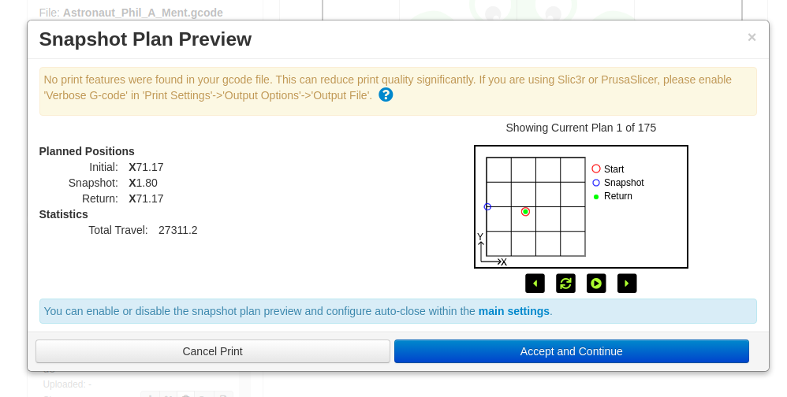
Una vez terminado podemos descargar el video final

[](https://drive.google.com/file/d/1beTKPCbZT-3oqMypq6v_Y5Z2LT0iaKjH/view?usp=sharing)


[Vídeo timelapse de Octolapse con Octoprint de una impresión 3D](https://drive.google.com/file/d/1beTKPCbZT-3oqMypq6v_Y5Z2LT0iaKjH/view?usp=sharing)

