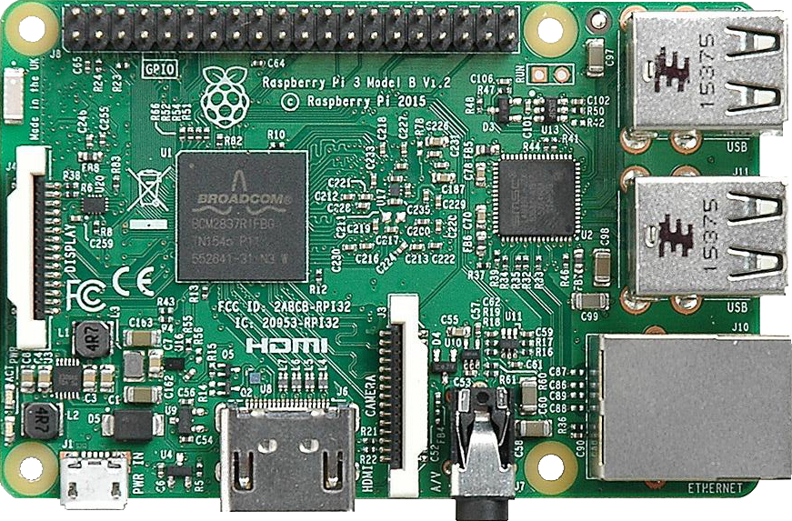
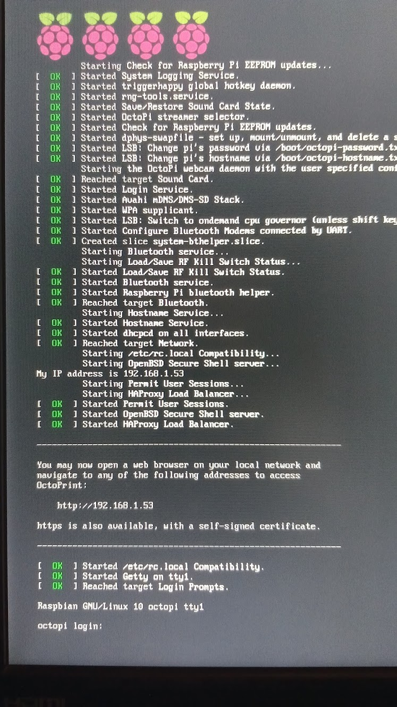

## [Octoprint](https://octoprint.org/)


[Octoprint](https://octoprint.org/) es un software de control remoto de impresoras 3D vía Web. Es OpenSource, creado por [Gina Häußge](https://www.linkedin.com/in/ginahaeussge)

¿Qué es? ¿para qué sirve?

¿Ventajas?

[](https://drive.google.com/file/d/1eOzrLx6OO-g5A0Qr4-20FlsI6U4BntKe/view?usp=sharing)


[Vídeo: 7.5.1 Controla remotamente tu impresora 3D con Octoprint](https://drive.google.com/file/d/1eOzrLx6OO-g5A0Qr4-20FlsI6U4BntKe/view?usp=sharing)

Podemos utilizar cualquier ordenador, pero en mi caso usaré una Raspberry:




[](https://drive.google.com/file/d/1cDrPsKW89hJVOzRsAyKaIQNjr-PQkUWg/view?usp=sharing)

[Vídeo: 7.5.2 Instalación de Octoprint](https://drive.google.com/file/d/1cDrPsKW89hJVOzRsAyKaIQNjr-PQkUWg/view?usp=sharing)

Desde la [página de descargas de octoprint](https://octoprint.org/download/) podemos descargar la aplicación para instalarla en nuestro sistema operativo o como en nuestro caso una imagen completa que flashearemos en una tarjeta SD utilizando [Balena etcher](https://www.balena.io/etcher/) 


También hay instrucciones para la [instalación en Windows](https://community.octoprint.org/t/setting-up-octoprint-on-windows/383/1) o [en Mac](https://community.octoprint.org/t/setting-up-octoprint-on-macos/13425)

Octoprint no incorpora un interface grádico, sino que está pensado para que lo controlemos remotamente vía web. Por ello antes de arrancarlo vamos a configurar el acceso a red. Podemos usar Wifi o un cable ethernet. En mi caso voy a usar wifi. 

Para configurarlo, antes de colocarla en la Raspberry accedemos a la tarjeta SD y editaremos el fichero "/boot/octopi-wpa-supplicant.txt" donde descomentaremos y rellenaremos los datos de acceso a nuestro wifi

```sh
# WPA/WPA2 secured
network={
  ssid="MiRedWifi"
  psk="miContraseñaWifi"
}

```

Ahora al arrancar se conectará y nos mostrará en pantalla la ip



También podemos acceder desde el nombre [http://octopi.local](http://octopi.local)

### Primera configuración

* Como en toda Raspberry tendremos acceso desde la consola y ssh con pi/raspberry
* Entramos a [http://octopi.local](http://octopi.local)
* Establecemos un usuario y contraseña para acceso vía Web
* Activamos si queremos las estadísticas anónimas de uso 
* Configuramos la frecuencia de la comprobación de conectividad y actualizaciones.
* Configuramos también si queremos usar la Lista negra de plugins, para evitar que se instalen plugins no autorizados.
* Por último configuramos nuestra impresora:
  * Nombre del perfil
  * Forma: cuadrada o circular
  * Origen (Home)
  * Si tiene base caliente
  * Si está dentro de una caja
  * Tamaño de impresión
  * En la pestaña de "Axes" configuramos las velocidades, que dejaremos por defecto
  * En la pestaña "Hotend & extruder" configuramos el nº de extrusores y el tamaño de la boquilla.
* Por último nos muestra las recomendaciones de uso: 
  * Por seguridad no deberíaos dejar desatendida nuestra impresora mientras imprime.
  * No debemos dejar accesible el servidor desde internet.

Si nos gusta el Octoprint y lo encontramos práctico podemos [donar al proyecto](https://octoprint.org/support-octoprint/)

[](https://drive.google.com/file/d/1TYERg2G9pl07Pw9yLjpjs26UdX1ees23/view?usp=sharing)

[Vídeo: 7.5.3 Configuración de Octoprint](https://drive.google.com/file/d/1TYERg2G9pl07Pw9yLjpjs26UdX1ees23/view?usp=sharing)

### Uso de octoprint

Cuando accedemos a octoprint [http://octopi.local](http://octopi.local), nos podemos encontrar que tenemos actualizaciones pendientes. Pulsamos para actualizar y tras la descarga, se instalan y se reinicia con la nueva versión.


Al acceder a Octoprint tenemos:

1. En el lateral el estade conexión de la impresora

vemos que aparecen varias pestañas:
* Temperatura: donde veremos las temperaturas actuales y las previstas
* Control: con una imagen central de la cámara y 


### Plugins


[OctoRelay](https://plugins.octoprint.org/plugins/octorelay/) nos permite encender y apagar nuestra impresora remotamente cuando enviemos algo para imprimir. Para ellos usaremos un cable de alimentación con un relé como interruptor que encendemos desde la Raspberry.

Cortamos uno de los hilos del cable para que el relé actúe como interruptor:


La conexión del relé con la Raspberry es sencilla:


Podemos incluir el relé con el cable en una caja:


Al instalarel plugin OptoRelay nos aparece icono en la cabecera por cada relé que incluyamos:


En la configuración del plugin seleccionaremos el pin GPIO con el que controlaremos el relé


Además del control manual, en la configuración podemos hacer que al enviar un nuevo trabajo de impresión se encienda la impresora y se apague al terminar.

Podemos controlar hasta 8 relés con otros tantos dispositivos: distintas luces, extractor, ....

(Imágenes cortesía de la documentación de OptoRelay)

## Cámaras remotas