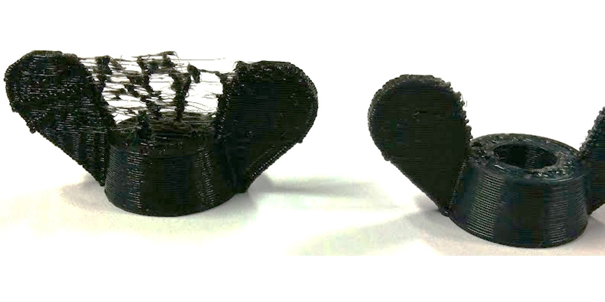

## Problemas al imprimir

[Vídeo: Fallos de impresión 3D](https://youtu.be/HSEIMJzSUuA)

A medida que vamos imprimiendo vamos aprendiendo a mejorar la calidad del resultado.

Problema de configuración de la impresión, probablemente al elegir "no usar soportes"

Problema de ajuste de la impresora, probablemente de tensión en la correa del eje X

Problema de ajuste de retracción

