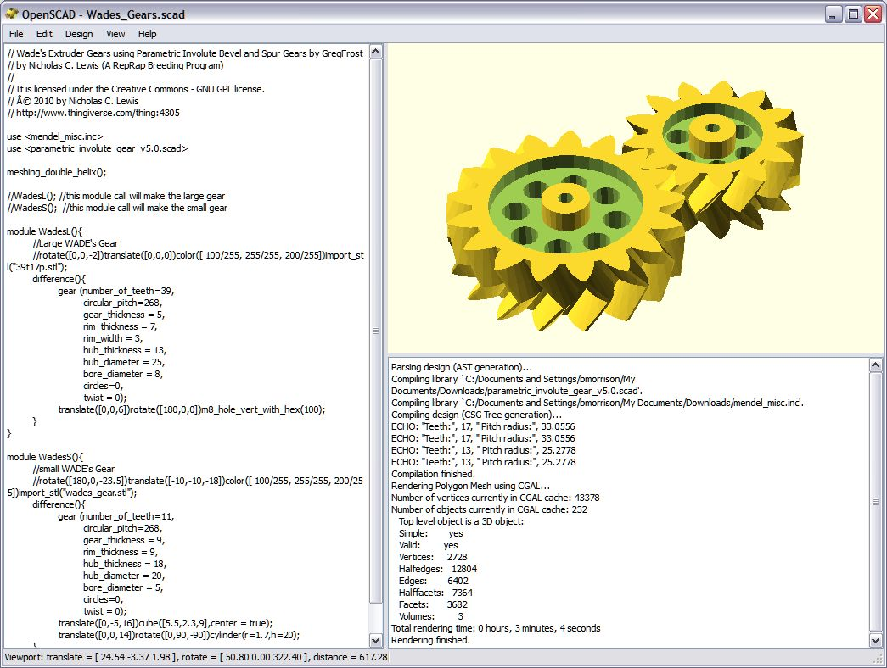

## [OpenSCad](http://www.openscad.org/) 

([Tutoriales](http://www.iearobotics.com/wiki/index.php?title=Obijuan_Academy#Tutoriales_Openscad))

Ejemplos de [María de Tecnoloxia](https://tecnoloxia.org/openscad/)

Tableta de chocolate

[Chuleta de openscad](http://openscad.org/cheatsheet/index.html)

[Polígonos](https://tecnoloxia.org/impresion3d/extrusion_poligonos/)

[Figuras 3D](https://tecnoloxia.org/impresion3d/figuras-3d/)

[Transformaciones y operaciones](https://tecnoloxia.org/impresion3d/transformacions/)

[Bucles y repeticiones](https://tecnoloxia.org/impresion3d/bucles/)

[Funciones](https://tecnoloxia.org/impresion3d/funcions/)

