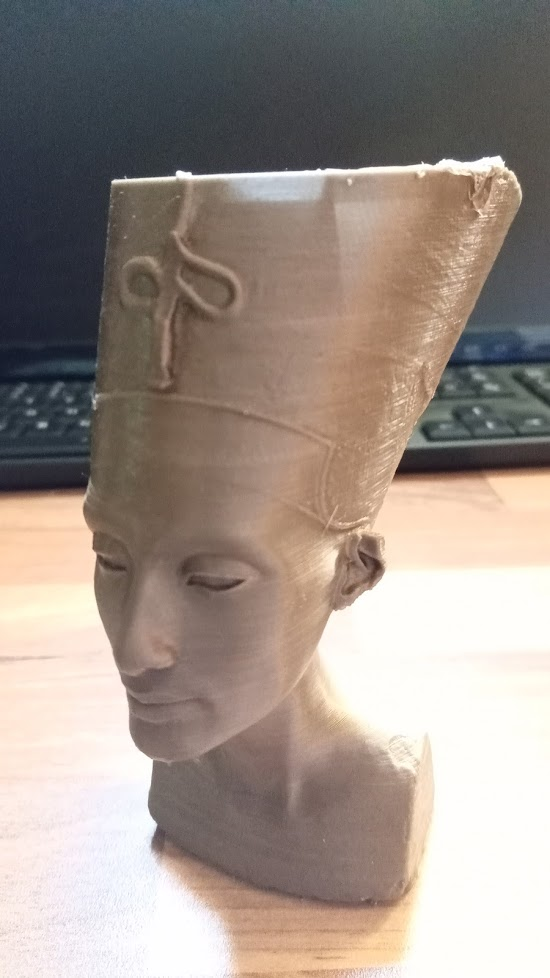
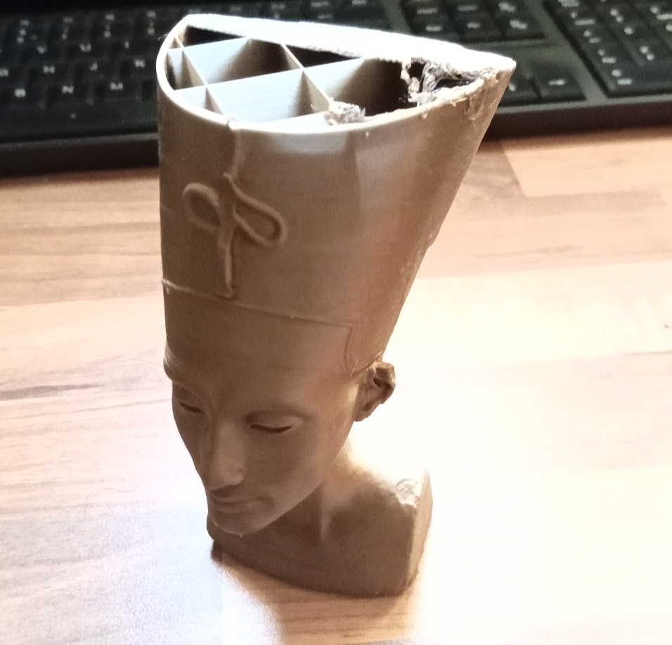
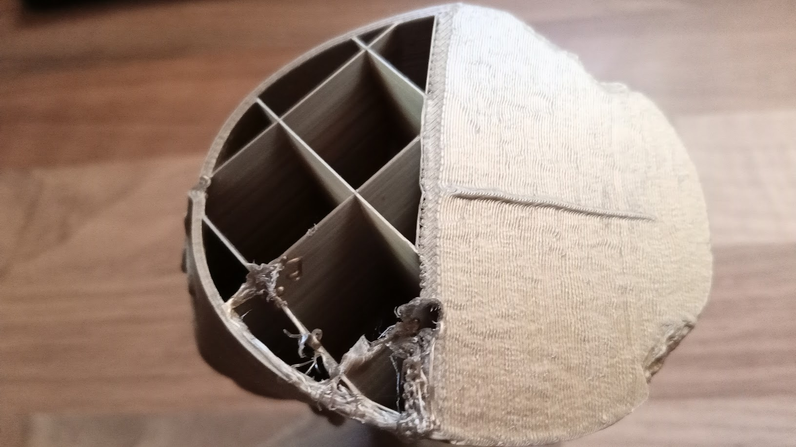
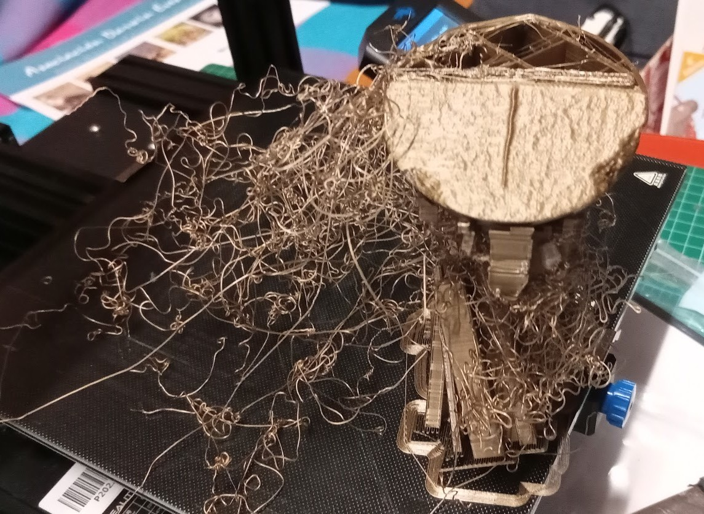
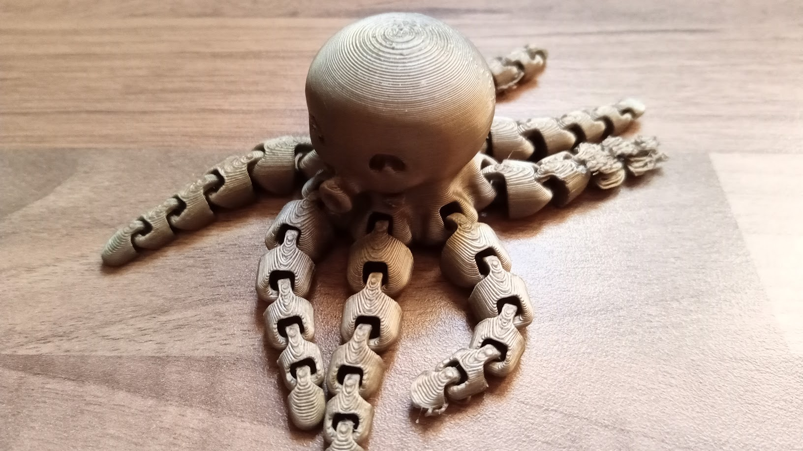
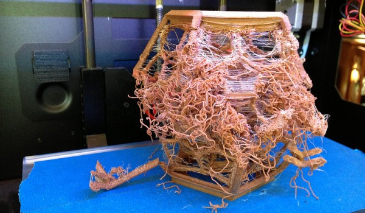
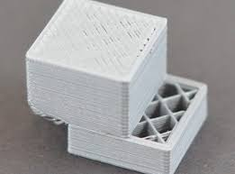
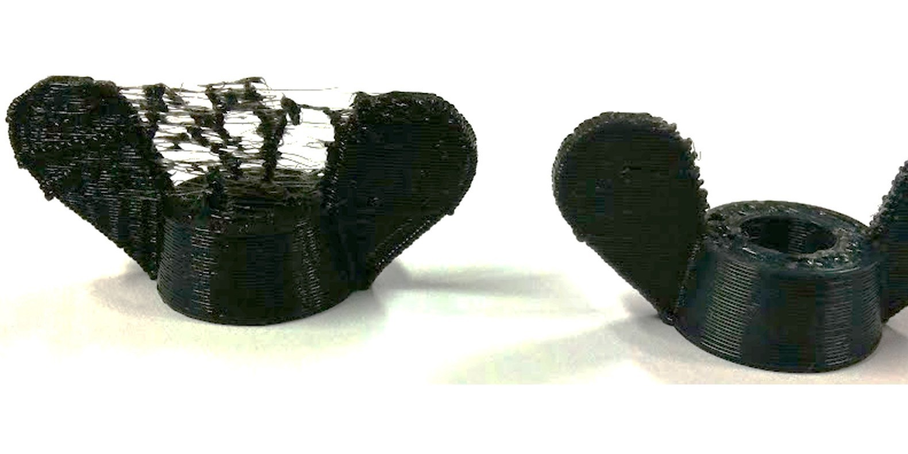
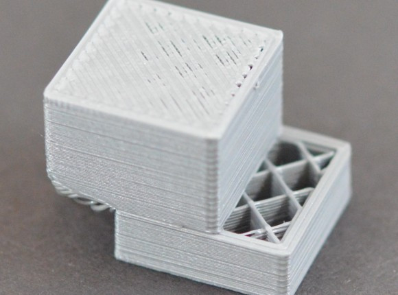

## Problemas al imprimir

A medida que vamos imprimiendo vamos aprendiendo a mejorar la calidad de los resultados, o no...

A veces el resultado de una impresión puede ser bueno o malo, según cómo lo miremos:

O incluso puede ser un auténtico desastre:

En este módulo vamos a hablar de los resultados realmente malos, de lo que no nos sirven... Intentaremos averiguar sus causas y cómo evitarlos.

En el busto de Nefertiti de las imágenes anteriores, la **baja temperatura de la base** dio lugar a una **falta de adherencia**, que hizo que la pieza se despegara cuando ya se imprimían las capas superiores, dando lugar a esta "peluca" de filamento:

En este otro caso, la **falta de calibración** de una esquina de la base hizo que una de las patas del pulpo se despegara, mientras que el resto sí se imprimió bien:

Otro ejemplo típico son los fallos de configuración en el laminado de la pieza:

En la imagen anterior vemos un ejemplo de **problema de configuración** de la impresión, probablemente al elegir "no usar soportes" en una pieza que los necesita...

Otras veces los problemas se producen por un fallo de la impresora o del ajuste de la misma. En la siguiente imagen vemos un ejemplo de un típico problema que se produce en una única dirección, X o Y que se suele llamar "salto de capa". Se produce cuando el extrusor no llega a la posición correcta en uno de los ejes.

Puede deberse a que la tensión en la correa del eje correspondiente no es la adecuada (normalmente demasiado baja) o bien a que el motor no recibe la suficiente potencia, en este caso por un problema de la electrónica, del driver de ese motor o de su ajuste.

### Problemas de ajuste de retracción

Realmente la retracción no suele dar lugar a piezas inservibles, pero es bastante molesta:

Cuando los **parámetros de retracción** no están bien ajustados, el movimiento del extrusor que no debía de depositar filamento va dejando pequeños (o no tan pequeños) hilos en el aire, dando lugar a defectos. Si estos pequeños hilitos se acumulan en algunas partes pueden dar lugar a problemas mayores.

Para resolverlo aumentaremos la **longitud de y la velocidad de retracción** poco a poco. Si los aumentamos mucho, lo que provocaremos es que cuando el extrusor vuelva a tener que expulsar filamento, este tarde en salir con la consiguiente falta de material.

## Sonido de golpeteo en el extrusor

Si mientras se está imprimiendo hoy más unos golpes rítmicos en el extrusor, suelen producirse al saltar los dientes del engranaje del extrusor sobre el filamento, quizás por no puede fluir el plástico:

* Quizás estamos imprimiendo demasiado cerca de la base o 
* Temperatura del filamento demasiado baja

## Desplazamiento de capas

Si al imprimir no encontramos que a partir de una capa, la pieza aparece desplazada, cláramente en un eje (delante/atrás o izquierda/derecha) lo más probable es que tengamos un problema con la tensión de las correas o de fuerza/potencia en el motor de ese eje:

* Comprobaremos si hay suficiente tensión en la correa de ese eje.
* Revisaremos si la electrónica o el motor se sobrecaliente

[Vídeo: Fallos de impresión 3D](https://drive.google.com/file/d/10DHcU27ALxLPxkPl0gK4ewX6x8hTO4gP/view?usp=sharing)

