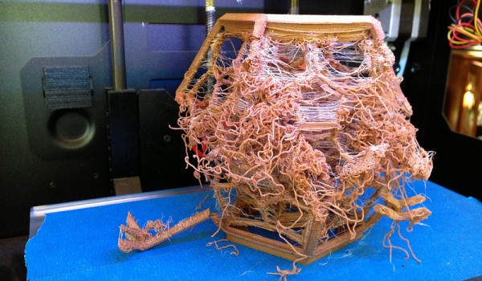

## Problemas al imprimir

[Vídeo: Fallos de impresión 3D](https://youtu.be/HSEIMJzSUuA)

A medida que vamos imprimiendo vamos aprendiendo a mejorar la calidad del resultado.

Problema de configuración de la impresión, probablemente al elegir "no usar soportes"

Problema de ajuste de la impresora, probablemente de tensión en la correa del eje X

Problema de ajuste de retracción

Enredado de filamento

## Sonido de golpeteo en el extrusor

Si mientras se está imprimiendo hoy más unos golpes rítmicos en el extrusor, suelen producirse al saltar los dientes del engrenaje del extrusor sobre el filamento, quizás por no puede fluir el pástico:
* Quizás estamos imprimiendo demasiado cerca de la base o 
* Temperatura del filamento demasiado baja

## Desplazamiento de capas

Si al imprimir no encontramos que a partir de una capa, la pieza aparece desplazada, cláramente en un eje (delante/atrás o izquierda/derecha) lo más probable es que tengamos un problema con la tensión de las correas o de fuerza/potencia en el motor de ese eje.
* Comprobaremos si hay suficiente tensión en la correa de ese eje.
* Revisaremos si la electrónica o el motor se sobrecaliente

## Referencias

[Manual de problemas de impresión de Bitfab](https://bitfab.io/es/blog/problemas-impresion-3d/)

[Solución a los problemas de impresión](https://filament2print.com/es/blog/78_problemas-soluciones-impresiones-3d.html)

[Guia de simplify3D](https://www.simplify3d.com/support/print-quality-troubleshooting/)