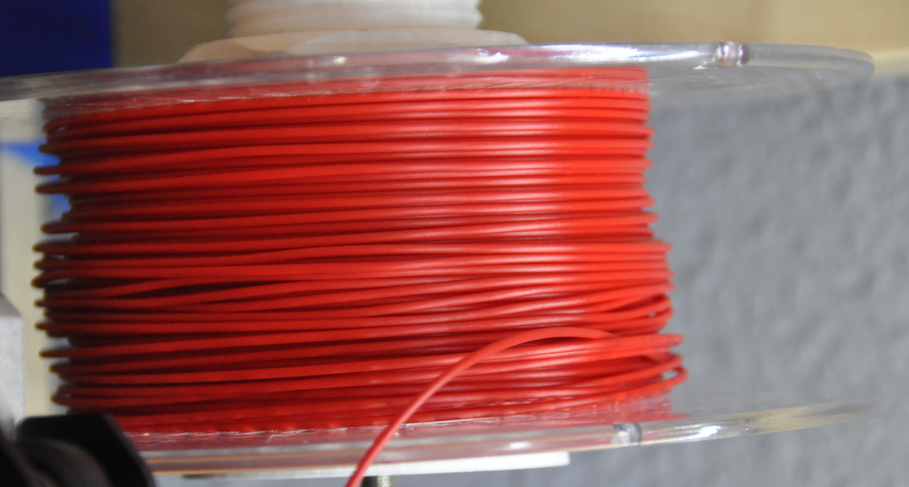

## Error debidos al filamento

Al margen de los errores debidos a mala configuración de la temperatura o de otros parámetros, el filamento puede producirnos algunos errores como los siguientes:

* Usar un tamaño de filamento distinto del que nuestra impresora necesita. Es el caso de que necesite filamento de 2.85mm y le pongamos filamento de 1.75mm (el contrario no se puede dar porque el filamento no cabe en el extrusor).

Si la impresión termina sin problemas (hemos tenido suerte...) la pieza quedará esponjosa, puesto que se habrá depositado menos filamento del que se debía depositar: el laminador determina la longitud de filamento que se necesita para depositar un volumen determinado (volumen = longitud x grosor), al ser menor el grosor se habrá depositado menos filamento

Lo más normal es que en este caso el filamento se acabe doblando y atascándose dentro del extrusor, como vemos en las imágenes siguientes:

Otro problema frecuente es el que el filamento se enrede, o tenga nudos porque alguna vuelta se introduzca por debajo de alguna otra:

El resultado suele ser que el nudo se acaba tensando, y el extrusor no puede tirar del filamento y se van depositando capas.

