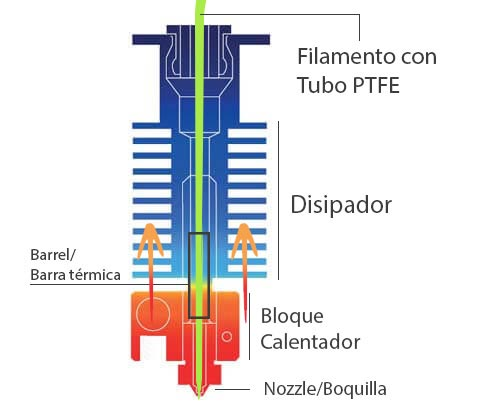
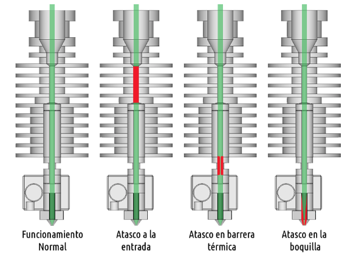
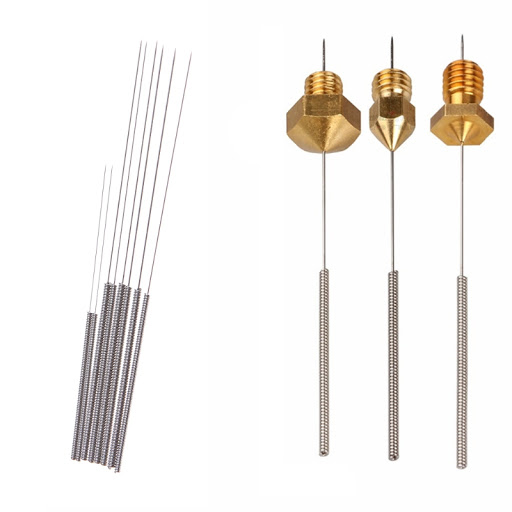

# Atascos

Los atascos son uno de los problemas más frecuentes en las impresoras 3D. Suelen ocurrir porque algún fragmento del filamento se queda pegado en la parte más fría del extrusor.

En nuestro extrusor se pueden producir atascos totales, en cuyo caso el filamento no se mueve y oiremos que el motor está forzado y da unos golpes rítmicos, que no son otra cosa que los engranajes golpeando el filamento, o atascos parciales que dejan pasar el filamento con dificultad.

En los atascos parciales veremos que se deposita una cantidad inferior a la esperada de filamento dando lugar a una textura esponjosa en nuestra impresiones. 

Ya hemos visto al hablar de la estructura del extrusor que es muy importante que se mantenga la diferentes temperaturas entre las distintas zonas del mismo. Un calentamiento de la zona fría puede provocar un poco de fusión en un filamento como el PLA que dé lugar a que se vayan acumulando restos.

Los atascos se pueden producir en distintas zonas:

* Pueden ocurrir en la parte superior,  más fría,  del extrusor, normalmente por rotura del filamento al extraerlo .

* Pueden ocurrir en la barrera térmica, habitualmente al cambiar el filamento se queda algún fragmento fundido en esa parte un poco más fría.

* También pueden ocurrir en la boquilla, probablemente el más frecuente dónde se van acumulando distintos fragmentos.

## Causas

Son muchas las causas y muchas veces es una mezcla de varias:

* Normalmente los atascos se producen porque al retirar el filamento no lo hacemos de una forma correcta, dejando algunos de los fragmentos, bien porque no lo hemos calentado lo suficiente o porque lo hemos calentado en exceso.

* Otra posible causa de los filamentos es que cometemos un error en la temperatura: por ejemplo calentando un filamento de ABS a temperatura de PLA no vamos a conseguir que esté completamente fluido y de esa forma se pueden producir restos que se pueden quedar dentro del extrusor

* También pueden ocurrir atascos por sobrecalentamiento: debido a un exceso de temperatura el filamento no se derrite sino que se quema dando lugar a un bloque sólido, normalmente dentro de la boquilla, que es muy difícil de eliminar.

* Otra causa frecuente de los atascos es que la boquilla esté demasiado cerca de la base de la impresora, lo que impide el correcto flujo del filamento, El exceso de presión que estamos produciendo sobre el filamento puede dar lugar a que se produzca un atasco en la entrada del extrusor.

* Cuando utilizamos algunos filamentos flexibles nos podemos encontrar también que se producen atascos en la entrada y en las distintas partes del extrusor debido a que estos filamentos no soportan bien la presión y la tracción a la que se les somete cuando estamos haciendo los rápidos movimientos de la retracción.

* El propio desgaste de los componentes del extrusor puede dar lugar a que se vayan produciendo atascos. Por ejemplo, el tubo PTFE,  debe de tener una superficie interna extremadamente lisa. Con el paso del tiempo y los cambios de temperatura a los que está sometido se pueden producir fisuras y ralladuras que dan lugar a que el filamento ya no se deslice bien y  se pueden ir acumulando restos de filamento fundido en estos defectos, dando lugar a que el funcionamiento del extrusor sea el correcto.

## Cómo evitarlos

El uso correcto de la impresora no nos garantiza que no se vayan a producir atascos pero sí minimiza su importancia y su frecuencia

* Es importante en los cambios de filamento retirar el filamento antiguo con decisión, sujetando el extrusor al mismo tiempo que retiramos el filamento (para evitar que el esfuerzo de la tracción se transmita a la estructura).

* El extrusor es una pieza fundamental de nuestra impresora y tenemos que darle cierto mantenimiento para conseguir que funcione correctamente.

* Es importante que vigilemos bien la temperatura adecuada de cada uno de los distintos filamentos con los que trabajamos para así evitar errores y calentamiento defectuosos 

* Cómo norma general si en algún caso vemos que el funcionamiento del extrusor no era adecuado no te vemos forzarlo y proceder a hacer una limpieza

## Resolución

Para resolver  el atasco, tenemos que conseguir retirar el fragmento de filamento que se ha depositado. Dependiendo de la posición en la que esté utilizaremos un procedimiento o otro pero en cualquier caso será una mezcla de retirar el filamento mecánicamente, es decir empujando con otro pedazo de filamento al que le afilaremos un poco la punta para que penetre más fácilmente, y un calentamiento del extrusor para conseguir que se derrita y se retire con mayor facilidad.

* Si el atasco está en la entrada del extrusor no servirá para nada el calentamiento puesto que esa es la zona más fría entonces tendremos que recurrir a métodos mecánico empujando el filamento intentando llevarlo a la parte más caliente para que se derrita.

* Para conseguir el calentamiento de la partícula de filamento, si esta se encuentra en la parte más fría del extrusor podemos recurrir a parar el ventilador durante un corto tiempo para que así se caliente un poco más la parte que normalmente está fría y el filamento se mueva con mayor facilidad.

* Si el atasco se ha producido en la boquilla,es más sencillo de resolver, el calentamiento normal del extrusor y un poco de presión con el filamento suelen bastar. También podemos calentando calentar un poco por encima de la temperatura habitual del filamento que estamos utilizando para conseguir que se produzca la limpieza. 

* En algunos casos puede ocurrir que a pesar de la limpieza se deteriore el material interno del extrusor y tengamos que recurrir a cambiarlo o bien la boquilla o bien lo que es el tubo PTFE que incluye alguno extrusores

* También existe un **filamento limpiador** que podemos adquirir y que lo que hace que el calentarse derrite los restos de filamento que quedará este kit de limpieza no tenemos que usarlo con excesiva frecuencia pero si puede ser conveniente si vamos a dedicarnos de una forma más constante a la impresión 3D.

* Existen unas **agujas de acero** muy finas  que nos permiten realizar también una limpieza del agujero de la boquilla en el caso en el que esté estuviera sucio. Al usarla debemos de tener cuidado de no agrandar el agujero de la boquilla en cuyo caso estaríamos cambiando la configuración de la impresora.

A veces tendremos que repetir varias veces el procedimiento hasta conseguir que se retire el filamento

## A evitar cuando tengamos un atasco

A evitar cuando estamos intentando liberar un atasco:

* Realizar excesiva fuerza sobre la estructura de la impresora debemos de sujetar firmemente el extrusor con cuidado de no quemarnos intentar que la fuerza nos ejerza sobre el resto de la tortura

* También debemos de evitar introducir **elementos extraños** ó metálicos que pueden rayar el interior del extrusor o dañar el tubo PTFE dando lugar a un problema aún mayor

* **No ponernos nerviosos**. Los atascos tarde o temprano van a ocurrir con el uso normal de la impresora. Son algo normal y qué ocurren porque se está utilizando un filamento semi-fundido dentro de materiales metálicos a altas temperaturas

