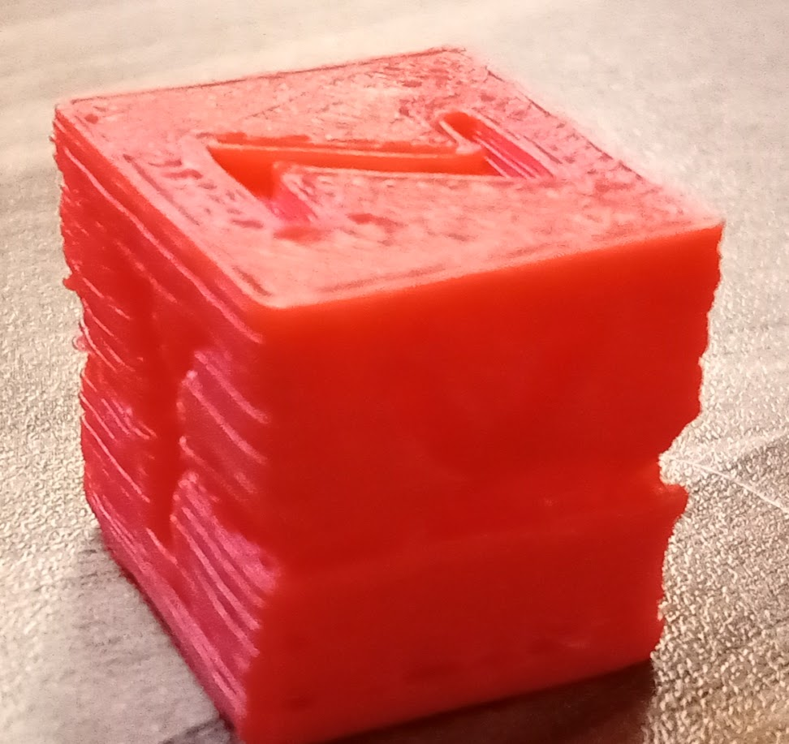
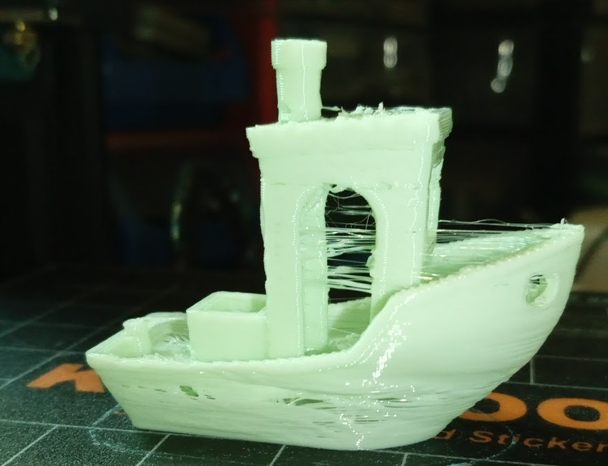

## Reconfiguración en caliente

A veces en medio de una impresión nos damos cuenta de que alguno de los parámetros de configuración que estamos usando no son los correctos y el resultado de la impresión no va a ser el esperado. Actualmente casi todas las impresoras disponen de una opción en el menú para modificar algunos parámetros mientras se hace la impresión.

Algunos ejemplos pueden ser:

* **Cambio en la temperatura  del extrusor**: si vemos que el filamento no está fluyendo correctamente podemos probar aumentar unos grados la temperatura del fusor. También podemos bajar la temperatura si el acabado de la pieza parece "derretido"

* Si vemos que la adherencia no es muy buena podemos aumentar la **temperatura de la base**, pero si ya hemos perdido adherencia no vamos a conseguir recuperarla... al menos que nos se separe más

* Si tenemos un acabado  algo "esponjoso" podemos aumentar el **% flujo de filamento** para corregir la **falta de filamento**:

* En algunos filamentos, el cambio de la **velocidad de impresión** puede conseguir importantes mejoras, como en esta pieza donde redujimos la velocidad un 50% a la mitad del casco, viéndose claramente la mejora:

