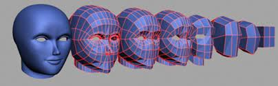
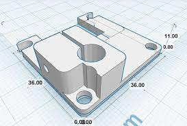
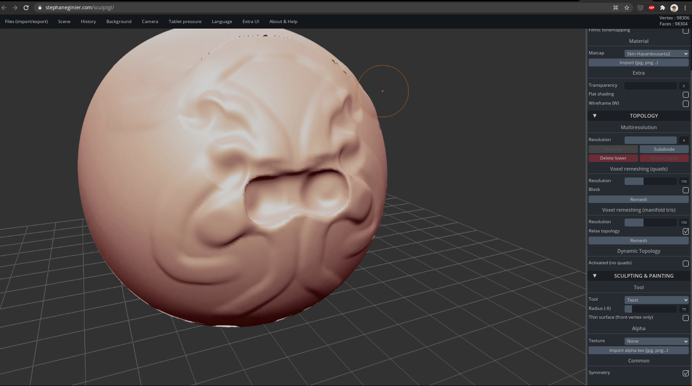
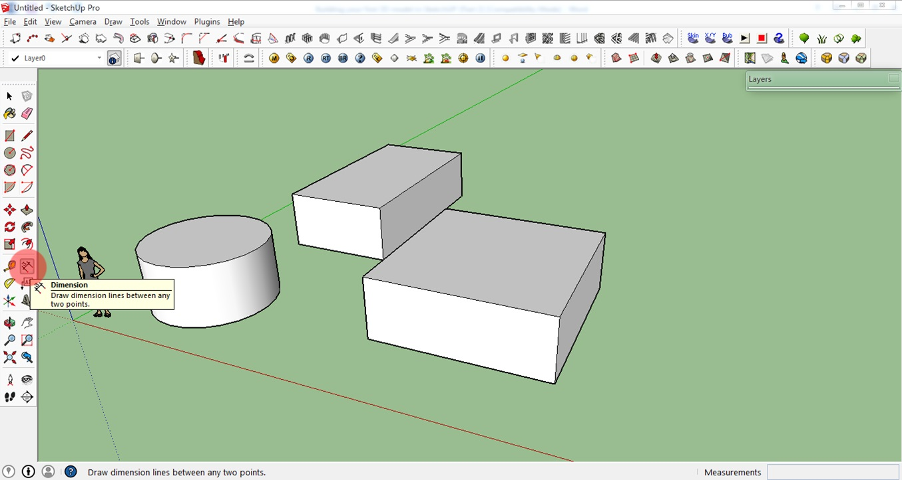

#### Herramientas de diseño en 3D

Existen muchas y diferentes herramientas para diseñar en 3D. De hecho existen casi tantas como usos diferentes podamos darle a estos diseños.

Podemos hacer una primera división en función de la manera en la que creamos nuestras piezas. Así Podemos hablar de **Diseño Orgánico** en el que estamos tratando de obtener diseños similares a los naturales:

Otro tipo de diseño es el llamado **Paramétrico** o **CAD** (Computer Aid Design) en el que estamos creando piezas que podríamos decir más geométricas visualmente y utilizando técnicas diferentes:

En el diseño orgánico se suelen utilizar herramientas más similares a las que se usan cuando estamos trabajando artísticamente, es decir, herramientas similares a las que se usan en la escultura, deformando una pieza, añadiendo material o empujando y tirando de diferentes partes de ella. En definitiva tratándola como si fuera un pedazo de barro.

Un ejemplo podría ser [Sculpt3D](https://stephaneginier.com/sculptgl/)

Entre los software orientados a diseño orgánico está [Blender](https://www.blender.org/), un software opensource de calidad 100% profesional también usado para crear efectos en películas.

En el diseño paramétrico o CAD, cómo se suele denominar, se trabaja con herramientas mucho más geométricas, en el sentido en que añadimos una serie de bloques **primitivos**, que ya están configurados y creados y que nos permiten, al unirlos entre sí, ir generando piezas cada vez más complejas. A estas mismas piezas con posterioridad se le aplican determinadas transformaciones que permiten crear el diseño definitivo.

También podemos ver distintos tipos de herramientas según el fin de las piezas o diseños. 

Para ello existen algunas herramientas con un fin claramente **industrial**, en el que no solamente queremos generar una pieza nueva, si no queremos trabajar el movimiento de ellas, el funcionamiento, cómo se conectan y en definitiva la creación de una máquina mucho más compleja. En este caso diríamos que están utilizando herramientas de diseño industrial. Un ejemplo de diseño industrial:

También existen otro tipo de herramientas en las que creamos un algoritmo o programa que genera una pieza 3D. Podemos pensar, por ejemplo, en un engranaje, en el que podemos programar cada uno de los dientes que lo forman o bien una pieza compleja a la que se llega añadiendo otras piezas más pequeñas. Hablamos de **Diseño algorítmico**.

* [OpenSCad](http://www.openscad.org/) nos permite programar los diseños con código.

* [BlockScad](https://blockscad.com) donde usamos bloques para programar el diseño.

* [Tinkercad](http://Tinkercad.com) también dispone de un módulo para programar diseños usando bloques.

### Arquitectura y diseño de interiores 

Existe software de diseño pensado para trabajar en decoración o en arquitectura, el objetivo es crear diseños de planos e interiores con un acabado fotorealistas.

La mayoría de ellos permiten incorporar mobiliario prediseñado, incluso de marcas (como Ikea)

Algunos de estos programas que incluyen una versión de prueba:

* [Home by me](https://home.by.me/es/)

* [Floor planner](https://es.floorplanner.com/)

* [Sweet home 3d](http://www.sweethome3d.com/es/)

* [SketchUp](https://my.sketchup.com/app) es un software muy pontente utilizado, entre otras cosas, para diseñar las vistas fotorealistas de Google Map y Google Earth. 

