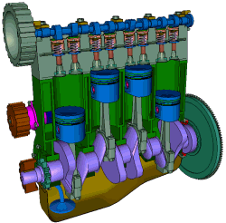

#### Herramientas de diseño en 3D

Existen muchas y diferentes herramientas para diseñar en 3D. De hecho existen casi tantas como usos diferentes podamos darle a estos diseños.

Podemos hacer una primera división en función de la manera en la que creamos nuestras piezas. Así Podemos hablar de **Diseño Orgánico** en el que estamos tratando de obtener diseños similares a los naturales:

Otro tipo de diseño es el llamado **Paramétrico** o **CAD** (Computer Aid Design) en el que estamos creando piezas que podríamos decir más geométricas visualmente y utilizando técnicas diferentes:

En el diseño orgánico se suelen utilizar herramientas más similares a las que se usan cuando estamos trabajando artísticamente, es decir, herramienta, similares a las que se usan en la escultura, deformando una pieza, añadiendo material o empujando y tirando de diferentes partes de ella. En definitiva tratándola como si fuera un pedazo de barro.

Un ejemplo podría ser [Sculpt3D](https://stephaneginier.com/sculptgl/)

Entre los software orientados a diseño orgánico está [Blender](https://www.blender.org/).

En el diseño paramétrico o CAD cómo se suele denominar, se trabaja con herramientas mucho más geométricas, en el sentido en que añadimos una serie de bloques **primitivos**, que ya están configurados y creados y que nos permiten, al unirlos entre sí, ir generando piezas cada vez más complejas. A estas mismas piezas con posterioridad se le aplican determinadas transformaciones que permiten crear el diseño definitivo.

También podemos ver distintos tipos de herramientas según el fin de las piezas o diseños. 

Para ello existen algunas herramientas con un fin claramente **industrial**, en el que no solamente queremos generar una pieza nueva, si no queremos trabajar el movimiento de ellas, el funcionamiento, cómo se conectan y en definitiva la creación de una máquina mucho más compleja. En este caso diríamos que están utilizando herramientas de diseño industrial. Un ejemplo de diseño industrial:

También existen otro tipo de herramienta en las que es lo que estamos creando es un algoritmo o programa cuyo fin es el general una pieza 3D paramos pensar por ejemplo en un engranaje en el que podemos programar cada uno de los dientes que lo forman o bien una pieza compleja a la que se llega añadiendo otras piezas más pequeñas.

### [FreeCad](http://www.freecadweb.org/)

 

[Curso de Freecad](http://www.iearobotics.com/wiki/index.php?title=Dise%C3%B1o_de_piezas_con_Freecad) 

### [OnShape](https://www.onshape.com/en/products/free)

[Documentación](https://www.onshape.com/en/resource-center/) [Tutorial de bitfab](https://bitfab.io/es/blog/onshape/)

### [Autodesk Fusion 360](https://www.autodesk.es/products/fusion-360/overview?term=1-YEAR) 

[breve tutorial](https://bitfab.io/es/blog/fusion-360-impresion-3d/)

### Herramientas orientadas a diseño de interiores, arquitectura o decoración

Existe software de diseño pensado para trabajar en decoración o en arquitectura:

[home.by.me](https://home.by.me/es/)

[floorplanner](https://es.floorplanner.com/)

[sweethome3d](http://www.sweethome3d.com/es/)

[SketchUp](https://my.sketchup.com/app)

## Diseño paramétrico

[Tinkercad](http://Tinkercad.com)

## Diseño algorítmico

[OpenSCad](http://www.openscad.org/) ([Tutoriales](http://www.iearobotics.com/wiki/index.php?title=Obijuan_Academy#Tutoriales_Openscad))

[BlockScad](https://blockscad.com)

[Tinkercad - bloques](http://Tinkercad.com)

