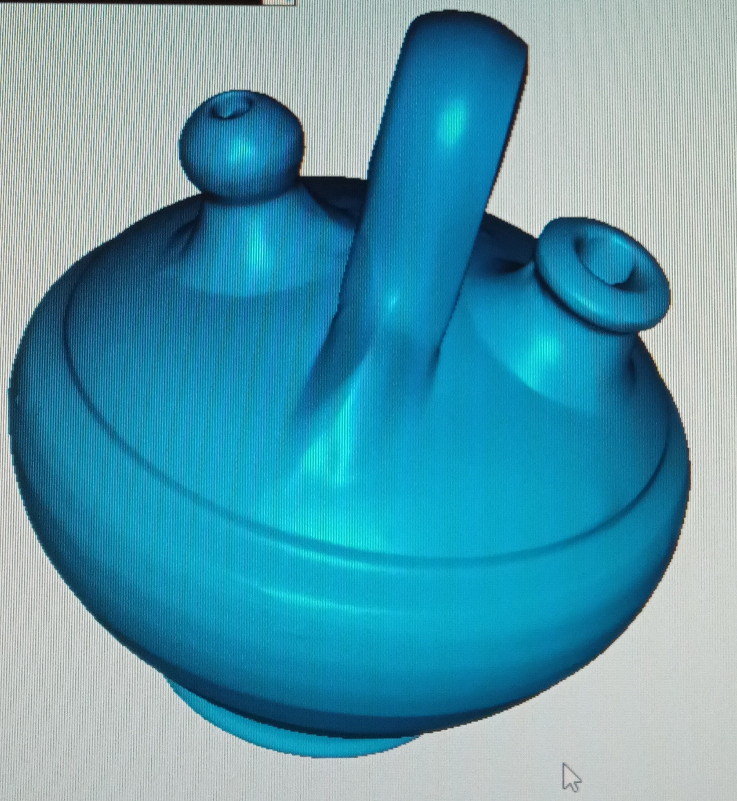
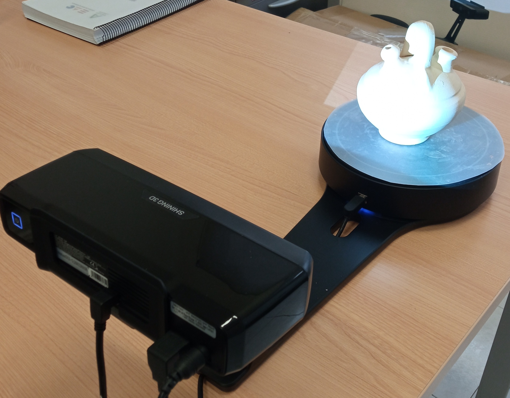
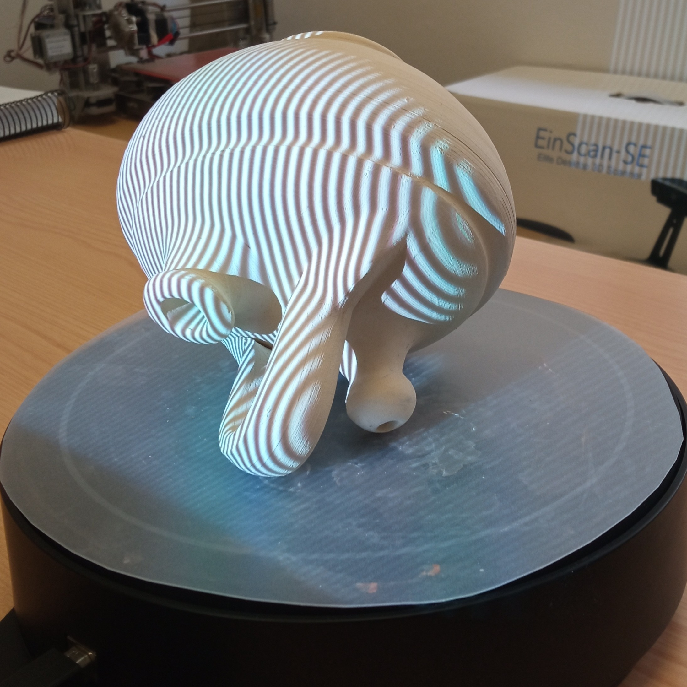
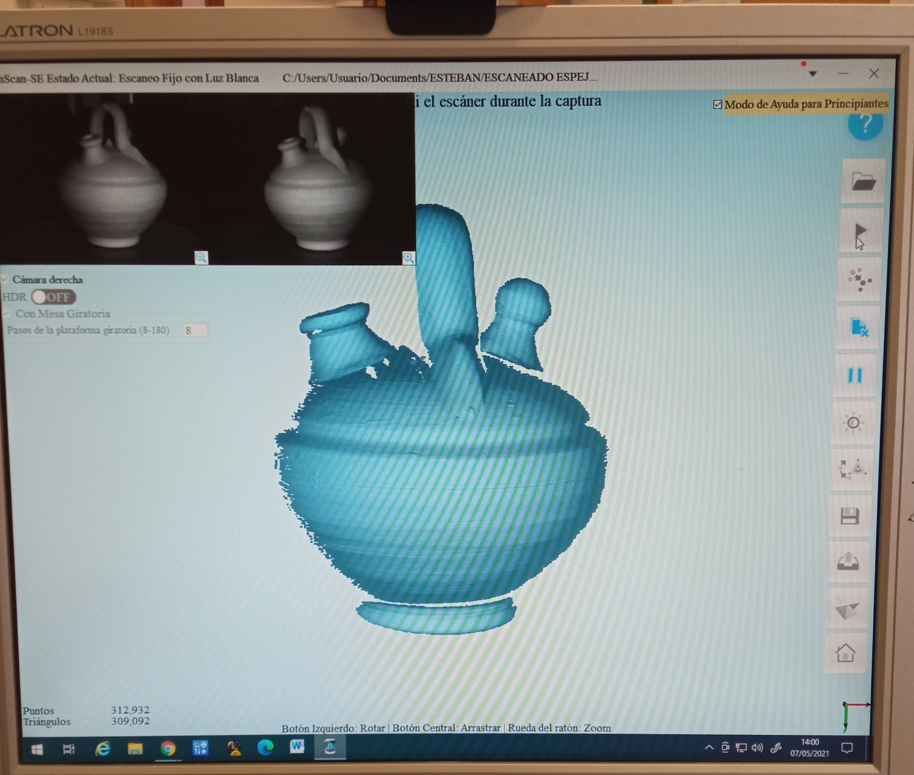
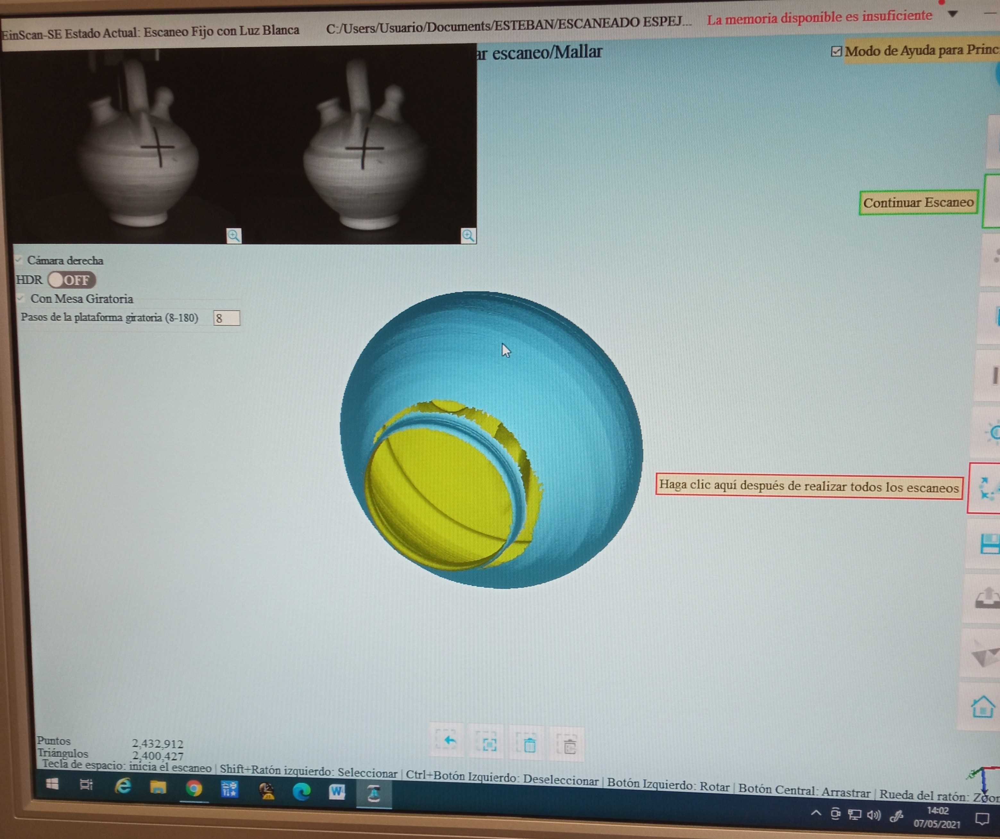
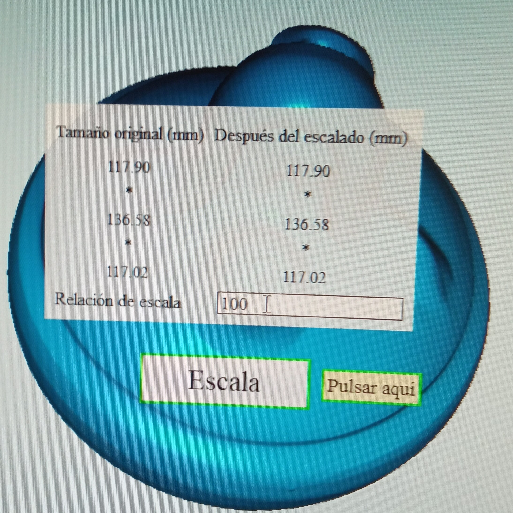
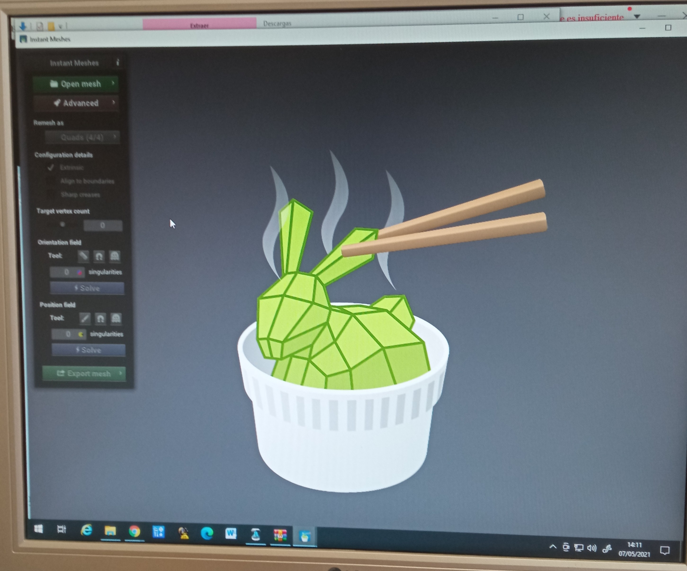
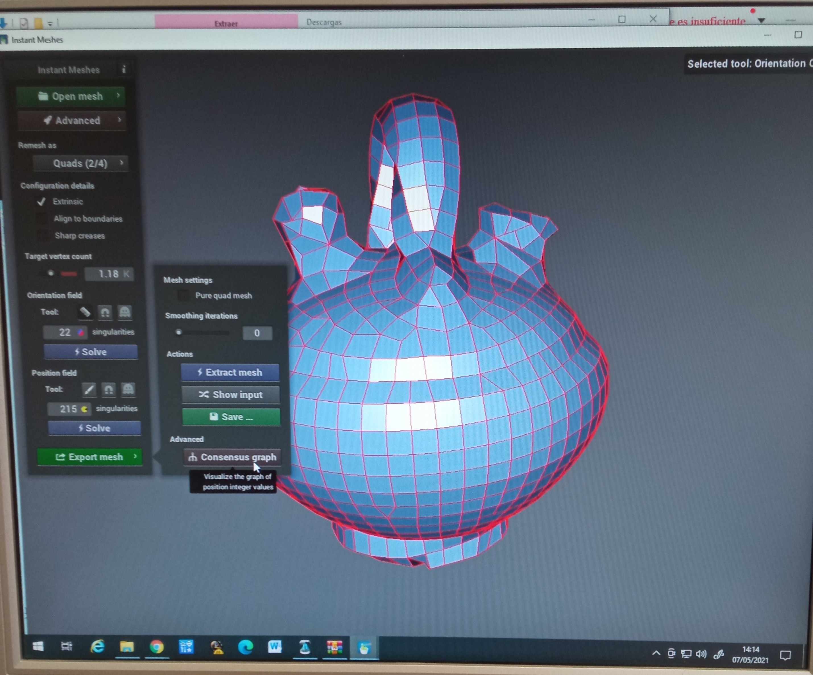

## Escaneado 3D

Una herramienta muy interesante cuando trabajamos en 3D es el poder escanear piezas reales. Para ello necesitamos Escáner 3D y un software que nos permite importar nuestros modelos

## Tipos de escáner 3D

* Escanner 3D DIY: permite escanear piezas pequeñas, rotándolas y tomando múltiples imágenes. Un software genera una nube de puntos

* Escanner profesional: se trata de un escaner de calidad profesional usado para escanear piezas de cualquier tamaño y con una calidad y detalle excelente

## Escáner de luz estructurada

(Gracias a Esteban Fernández Navarro por esta documentación)

En relación a la realización o prototipado de diseños propios hay dos caminos, el modelado 3D o el escaneado de modelados en material plástico.

Con respecto al escaneado en la escuela utilizamos dos métodos; la fotogramatería y el escáner de luz estructurada modelo **EinScan-SE**.

La **fotogrametría** es un método que necesita hacer muchas fotos de un objeto, con alta resolución y buena profundidad de campo. 

Es muy importante que las fotos tengan unas condiciones mínimas de calidad.

El programa que utilizo es de softwarw libre, un poco limitado pero lo justo: Regard 3D

El resultado que se obtiene es este:

El otro método es el escáner que dispone de su propio software y es más adecuado para objetos pequeños de hasta 20 cm.

El resultado es un modelo muy detallado que se puede remodelar o imprimir directamente.

Vamos a explicar con más detalle el proceso de escaneado con el **escáner EinScan-SE**

El escaner dispone de una cámara estereoscópica que permite obtener imágenes 3D con luz estructurada. Puede escanear con color o solo el volumen. Dispone de un plato giratorio que captura los 360º del objeto a intervalos de 45º.

En este caso he utilizado un botijo de cerámica:

Solo se escanea la superficie visible que esté dentro del rango de tamaño de la cámara; 20 cm.

Para completar el resto de la superficie del objeto volvemos a colocarlo sobre el plato giratorio en otra posición y volvemos a escanear tantas veces como sea necesario.

Las imágenes que va tomando el escáner las va superponiendo con el reconocimiento de los puntos espaciales que tiene en común la imagen, aunque también se pueden alinear a mano.

Finalmente se obtiene un modelo formado por una nube de puntos con los cuales podemos formar una malla de triángulos. La resolución es muy alta. El programa te permite reducir la cantidad de información del modelo. En el ejemplo de la imagen, con una resolución baja obtenemos un modelo con más de 4.000.000 de triángulos. Para que no se bloquee el ordenador tengo que diezmarlo hasta quedarse con un modelo con 100.000 triángulos.

El programa te permite generar la malla abierta o cerrada y modificar la escala del objeto.

El resultado se puede archivar en stl, obj, y otros formatos 3D

Para simplificar aún más el modelo o para trabajar con una malla ordenada utilizo otro programa de software libre (Instant Meshes) con el que puedes obtener un modelo más ordenado de polígonos cuadrados o triangulares para imprimir o mejor aún, para remodelar en blender.

## Escáner 3D DIY

Si quieres puedes montarte este [escáner 3D DIY](https://www.thingiverse.com/thing:3958326)

Es un escáner para fotogrametría con un móvil:

* Necesita un montaje con arduino (conozco un curso donde explican cómo hacerlo)
* Hay que imprimir algunas piezas
* Utiliza un móvil para tomar las imágenes
* Usa un mando a distancia bluetooth para disparar las fotos

[Tutorial Escaneado 3D con móvil](https://bitfab.io/es/blog/escanear-3d-movil/)

