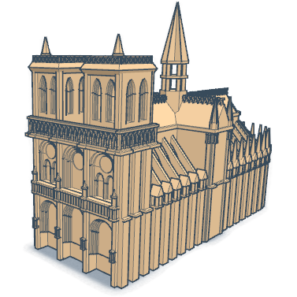

# [TinkerCad.com](https://www.tinkercad.com/)

Tinkercad es una herramienta online gratuita para comenzar a diseñar en 3D. Aunque a primera vista parece una herramienta para niños, con un poco de práctica nos permite hacer diseños bastantes avanzados:

Utiliza un modelo aditivo, es decir vamos añadiendo componentes básicos hasta generar nuestro diseño.

* Vamos a hacer una introducción a su uso:

[Vídeo: 0. Introducción al diseño 3D con  Tinkercad](https://drive.google.com/file/d/1CAok4UF-qGb3JR4TMXlm3pS_s-qQC04e/view?usp=sharing)

* Necesita crearse una cuenta: Podemos crearla con nuestro email o usar la autenticación de Google o de Facebook

[Vídeo: 1. Creación de un cuenta en Tinkercad](https://drive.google.com/file/d/1oafxrB9_Afyq467kIS-et7ghOzUb0Zrb/view?usp=sharing)

* Al entrar encontramos tutoriales sencillos con los que empezar a aprender.

## Interface

Creación de piezas y movimiento del punto de vista

[Vídeo: 2. Primeras piezas con Tinkercad. Movimiento de piezas y cambio del punto de vista](https://drive.google.com/file/d/1ZihlMHPM34beEJcGQhUgReaog3JDfdz_/view?usp=sharing)

## Paletas de componentes

A la derecha encontramos las paletas de primitivas:

  * Geometrías  
  * Letras, Números y símbolos
  * Favoritos
  * Extras
  * Usar los Generadores de Formas: Hay muchísimos!!!
  * Componentes
  * ¡¡Huecos!!

[Video: 3. Uso de paletas de primitivas](https://drive.google.com/file/d/16HLUdWgSOmbnK2T5we5QDWT_EFRt1v0-/view?usp=sharing)

## Propiedades de un diseño

[Video: 4. Propiedades de un diseño](https://drive.google.com/file/d/1cBk0I7zdudxTM0j3HgJKdoz-nK02bocn/view?usp=sharing)

## Giros y rotaciones

[Video: 5 Giros y rotaciones](https://drive.google.com/file/d/1Z1YQ0bZRSdEIl9aSInAokpPQ0HU6A36a/view?usp=sharing)

## Ejemplo: diseñando una casita

Vamos a hacer un diseño sencillo de una casita, usaremos los elementos que hemos visto y la herramienta de cambio de **plano de diseño**

[Video: 6. Ejemplo: una casita](https://drive.google.com/file/d/1_eg8brz1fdx0EWn70wXMl7xLcq2DXGzD/view?usp=sharing)

## Agrupar y desagrupar elementos

Al agrupar varias piezas hacemos que todas ellas se comporten como una sola, a la hora de moverlas, redimensionarlas, rotarlas, etc... lo que es muy útil para ir construyendo diseños más complejo.s

La agrupación puede ser sucesiva, es decir, podemos agrupar nuevos elementos sobre los que ya habíamos agrupado otros.

De la misma manera, cuando los vamos desagrupando, se hace progresivamente.

[Video: 7. Agrupar y desagrupar elementos](https://drive.google.com/file/d/1tQCUuhg-krdwzpap2_xn_qtJgFC4c7fi/view?usp=sharing)

## Copiar pegar objetos

Una vez tenemos una pieza diseñadas podemos crear copias con las herramientas copiar/pegar

## Alineamiento de componentes

Podemos usar la herramienta de alineación para colocar varias piezas alineadas, bien sea a la izquierda, centradas o a la derecha.

* Seleccionamos las piezas que queremos alinearç
* Pulsamos sobre la herramienta de alineamiento (junto a la de agrupar/desagrupar)
* Seleccionamos donde queremos alinearlas
* Pulsamos las diferentes piezas seleccionadas para decidir cuál marca la referencia

## Trabajando con huecos

Del mismo modo que trabajamos añadiendo bloques, también podemos "restar" volúmenes usando bloques **huecos**, es decir usaremos las mismas primitivas, pero marcándolos como "Hueco". Al agruparlos con otros componentes su volumen se restará.

## Importación de diseños

Podemos importar diseños en los típicos formatos que usamos para impresión 3D, como STL o OBJ:

También podemos importar otros diseños hechos en Tinkercad, bien sean nuestros o de otros usuarios que los hayan compartido públicamente:

## Convertir un diseño 2D a 3D

Por ejemplo, importar un logo y darle aspecto 3D e incluirlo en nuestro diseño

* Elegimos la imagen, mejor si es un formato que permita fondo transparente, como PNG o SVG. 
* Si es SVG (formato vectorial) podemos escalarla sin pérdida de calidad.
* Si no es SVG podemos convertirlo a svg con [este conversor online](https://image.online-convert.com/) o con herramientas de escritorio como InkScape

Cuando ya tenemos la imagen

* Abrimos nuestro modelo en Tinkercad
* Importamos la imagen, seleccionando la altura y el tamaño.

### Ejemplo completo: Diseñando un clon del personaje de Among Us

## Resumen de funcionalidad

* Plano de trabajo
    * Podemos cambiar el plano de trabajo y así todo lo que hagamos se referirá al nuevo
  * A la derecha las paletas:
    * Geometrías  
    * Letras, Números y símbolos
    * Favoritos
    * Extras
    * Usar los Generadores de Formas: Hay muchísimos!!!
    * Componentes
    * ¡¡Huecos!!
  * Ocultar
  * Copiar y pegar
  * Duplicar
  * Duplicar ultimo proceso
  * Copiar entre proyectos
  * Podemos importar: modelos STLs, diseños tinkercad y 2D
  * ¡¡Tiene deshacer!!
  * Sobre una pieza podemos girar, mover, cambiar de tamaño, según selecciones los distintos puntos o flechas
  * Si tenemos varias piezas podemos
      * Alinearlas
      * Agruparlas
  * En propiedades podemos cambiar el nombre  
  * Usar la regla sobre un objeto y así modificar sus dimensiones o ángulos

## Teclas

* Ctrl + C, Ctrl + V Copy and paste
* Ctrl + Z, Ctrl + Y Undo and redo your last step(s)
* Ctrl + D Duplicate the selected object(s)
* Ctrl + H Hide the selected object(s)
* Ctrl + Shift + H Show all hidden objects
* Ctrl + G Group the selected objects into one shape
* Ctrl + Shift + G Separate a shape into the single objects
* L Opens the align tool
* M Takes you to the mirror tool

