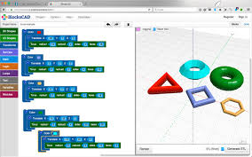

# [BlockScad](https://www.blockscad3d.com/editor/)

[BlockScad](https://www.blockscad3d.com/editor/) es un programa de diseño algorítmico que utiliza bloques para definir el programa que genera un diseño 3D. Podemos trabajar con él desde su web, sin necesidad de instalar nada.

Tras la aparente simplicidad de los bloques permite hacer diseños muy complejos.

* Operaciones lógicas entre las partes de un diseño
* Transformaciones
* Uso de funciones matemáticas complejas

[Tutoriales](https://www.blockscad3d.com/edu/lessons/)

[Recuraos para profesores](https://www.blockscad3d.com/edu/resources/)
