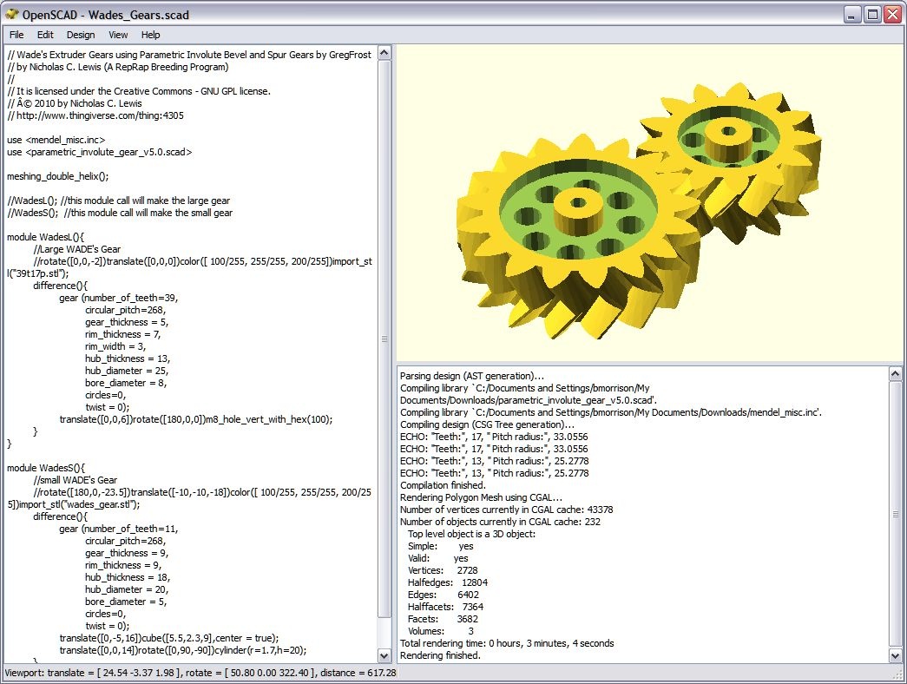
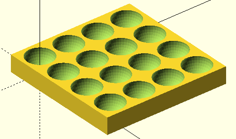
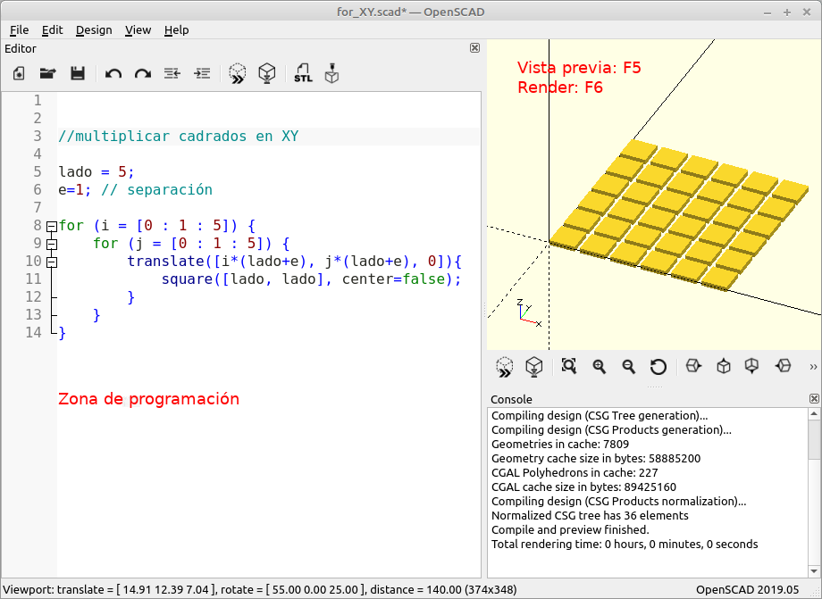

## [OpenSCad](http://www.openscad.org/) 

[OpenSCad](http://www.openscad.org/) es un software opensource de diseño algorítmico que nos permite generar piezas a partir de un programa, que usa un lenguaje similar a C++.

Podemos instalarlo descargando desde su [página de descargas](http://openscad.org/downloads.html)

Es muy útil para hacer diseños en los que hay partes repetitivas, como esta (parte de los ejemplos de [María de Tecnoloxia](https://tecnoloxia.org/openscad/) )

O esta típica "Tableta de chocolate"

Vemos que a la derecha está la zona de programación y a la derecha vemos el diseño resultante

Podemos ver las operaciones disponibles en esta [Chuleta](http://openscad.org/cheatsheet/index.html)

Normalmente trabajaremos con piezas primitivas (poliedros, cilindros, esferas, etc..) a las que aplicamos transformaciones (movimiento, rotación, escalado, ...) y realizando operaciones lógicas entre ellos (intersección, unión, diferencia, ...)

