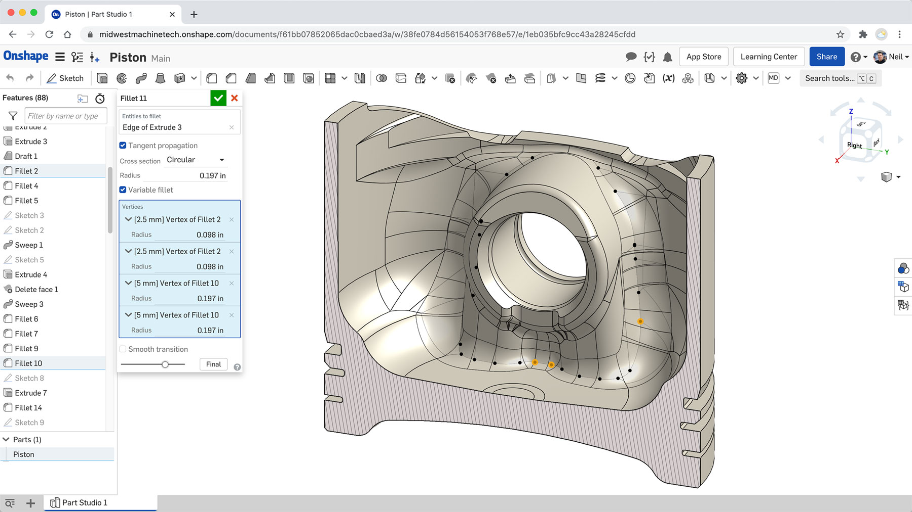
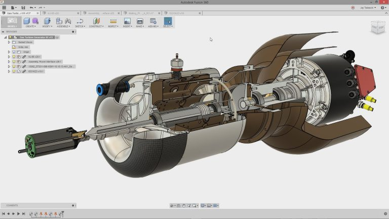

## Otras herramientas de diseño 3D

Existen multitud de herramientas comerciales para diseño 3D, veamos algunas y dónde aprender sobre ellas

### [OnShape](https://www.onshape.com/en/products/free)

Dispone de una versión "Maker" o "Educativa" que podemos usar de formar gratuita

Una de las características más interesantes es que permite trabajar conjuntamente a varios usuarios sobre un mismo modelo.

[Documentación](https://www.onshape.com/en/resource-center/) 

[Tutorial de bitfab](https://bitfab.io/es/blog/onshape/)

### [Autodesk Fusion 360](https://www.autodesk.es/products/fusion-360/overview?term=1-YEAR) 

Es una de las mejores herramientas y se puede conseguir una licencia educativa.

[breve tutorial](https://bitfab.io/es/blog/fusion-360-impresion-3d/)

