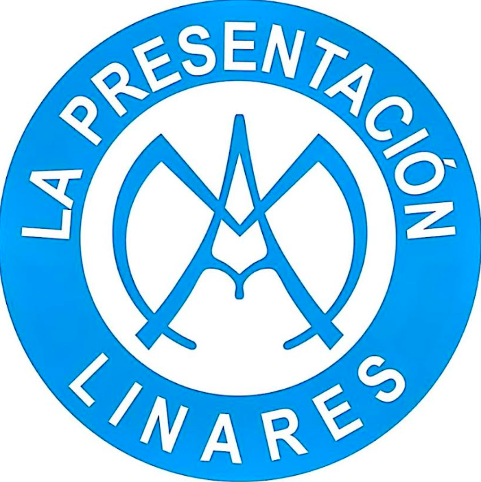
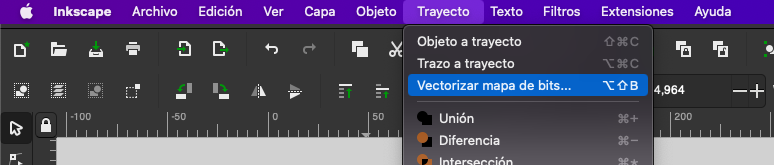
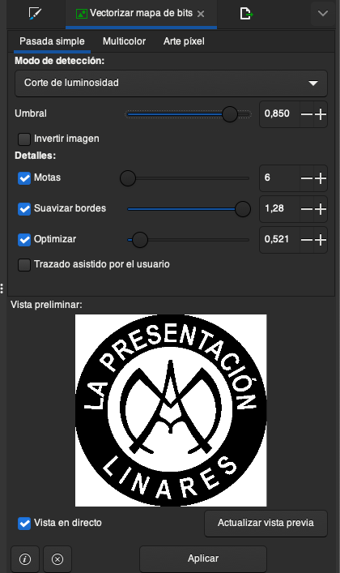
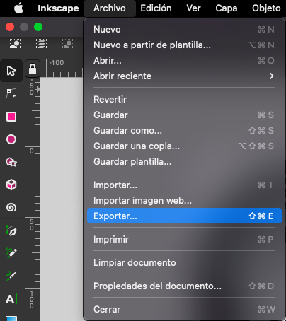
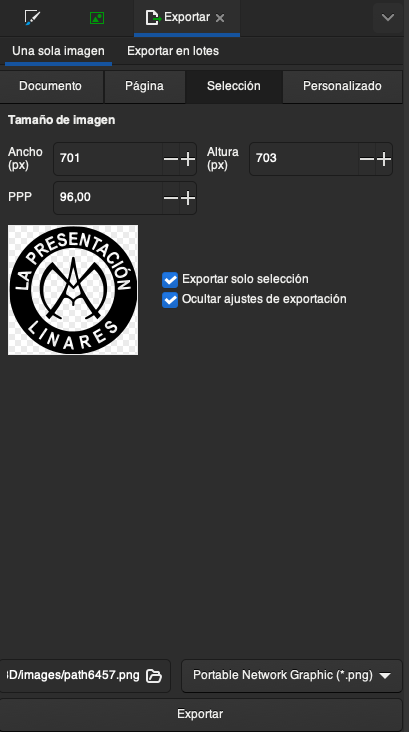
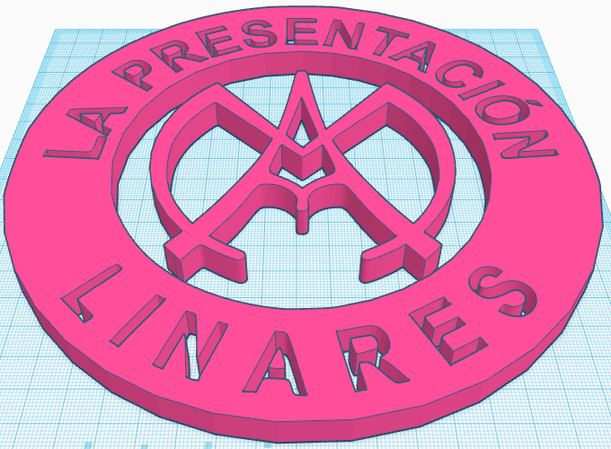

# 2D a 3D

Veamos cómo crear un objeto 3D a partir de un logo. Funciona mejor con imágenes vectoriales (que suelen ser más sencillas)

## Importación en Tinkercad:

* Elegimos la imagen
* Si no es SVG lo convertimos a SVG unsando un [conversor online](https://image.online-convert.com/) o Inkscape, como veremos a continuación
* Abrimos Tinkercad
* Pulsamos el botón Import y elegimos tamaño y altura.

## Inkscape

Vamos a ver cómo vectorizar una imagen de mapa de bits usando el software libre InkScape

1. Instalamos el software libre de edición vectorial [Inkscape](https://inkscape.org)

2. Cargamos la imagen del logo en inkscape, mejor cuanto más simple y a ser posible con 2 colores. Por ejemplo este:

En este caso se ve que se han usado colores distintos para el contorno de las formas y el relleno, mejor sí sólo tenemos 1 color

3. Pulsamos la opción de menú Trayecto -> Vectorizar mapa de bits (Path -> Vectorize bitmap)

4. Existen diferentes formas de vectorizar, según colores, luminosidad, contornos... Vamos probando y ajustando los parámetros que tienen cada uno hasta encontrar el resultado deseado, ya que vemos la previsualización del resultado

5. Una vez tenemos un resultado que nos gusta, exportamos el fichero en formato SVG que es el que admite la importación de Tinkercad.

Pulsamos en la opción Archivo -> Exportar

Seleccionamos las opciones de "Sólo la selección", la carpeta destino y el nombre desado y pulsamos "Exportar"

Ya tenemos nuestro fichero exportado

6. Importamos en Tinkercad el fichero SVG, pudiendo ajustar el tamaño y la altura

[Resultado vectorizado](https://www.tinkercad.com/things/k1Toe3QKslz)

[Vectorizar con InkScape](https://inkscape.org/es/doc/tutorials/tracing/tutorial-tracing.html)

## Freecad

* Necesitamos que sean un conjunto de path
* Importamos como geometria
* En la perspectiva Path, extruimos como solido

### Gerenado bocetos

* Part desing
* Boceto
