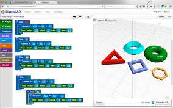

# [BlockScad](https://www.blockscad3d.com/editor/)

Programa de diseño paramétrico (Como OpenScad) pero que utiliza bloques para definir el programa.

Tras la aparence simplicidad de los bloques permite hacer diseños muy complejos.

* Operaciones lógicas
* Transformaciones
* Uso de funciones matemáticas complejas

[Tutoriales](https://www.blockscad3d.com/edu/lessons/)

[Recuros para profesores](https://www.blockscad3d.com/edu/resources/)
