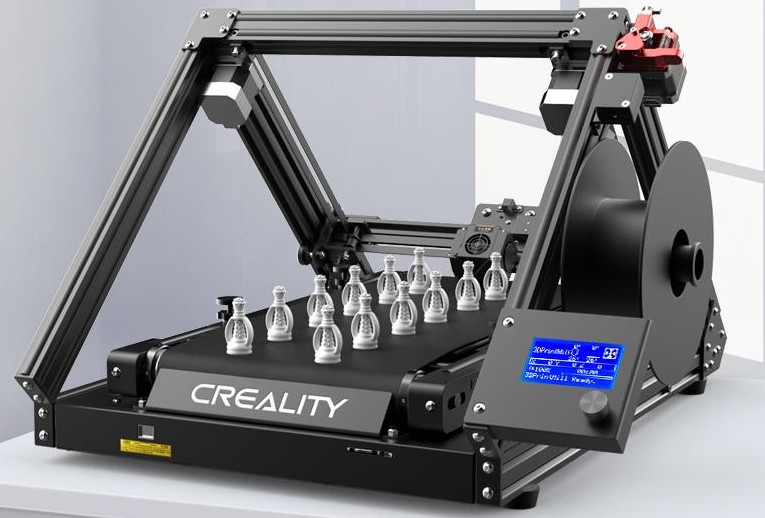

## Impresora de Eje Z "infinito"

Ya hay en el mercado algunos modelos de impresoras 3D con lo que han llamado eje z "infinito", eso quiere decir que usando una geometría diferente y deslizando la pieza a medida que se imprime se pueden conseguir impresiones de un tamaño mucho mayor al de la estructura de la impresora o bien imprimir muchas piezas en serie.

Vamos a ver un ejemplo con la impresora [Creality Cr-30 3DPrintMill](https://www.creality3dofficial.com/es/products/cr-30-infinite-z-belt-3d-printer):

Como véis en la imagen, la impresora tiene una arquitectura particular y en la base en lugar de tener un placa sólida, incorpora una cinta trasportadora que se mueve a medida que se va imprimiendo la pieza, cayendo esta al llegar al final de la base y permitiendo imprimir muchas piezas, en principio, sin nuestra intervención

Además se le pueden poner un unas barras deslizantes en el extremo para hacer que la parte de la pieza ya impresa vaya deslizando

Podemos hacer que se impriman muchas piezas en serie o una pieza muuuuy larga:

Para ello hace falta usar una versión específica de laminador que nos lo permite:

No he tenido la suerte de probarla pero muchos makers que sí lo han hecho han quedado bastante satisfechos.

(Todas las imágenes cortesía de Creality)

## Adaptación de una impresora normal a z-infinito

Ya han aparecido varios tutoriales en los que nos explican como hacer estas transformación, como [este instructable](https://www.instructables.com/EnderLoop/) en el que se explica cómo hacer la transformación:

* Imprimendo [nuevas piezas](https://www.thingiverse.com/thing:4658201)
* Modificando la geometría
* Ajustando la cinta
* Recableando
* Actualizando el firmware
* Usando **BlackBelt Cura**, una versión modificada de Cura para este tipo de impresoras (ventajas de usar software libre)

