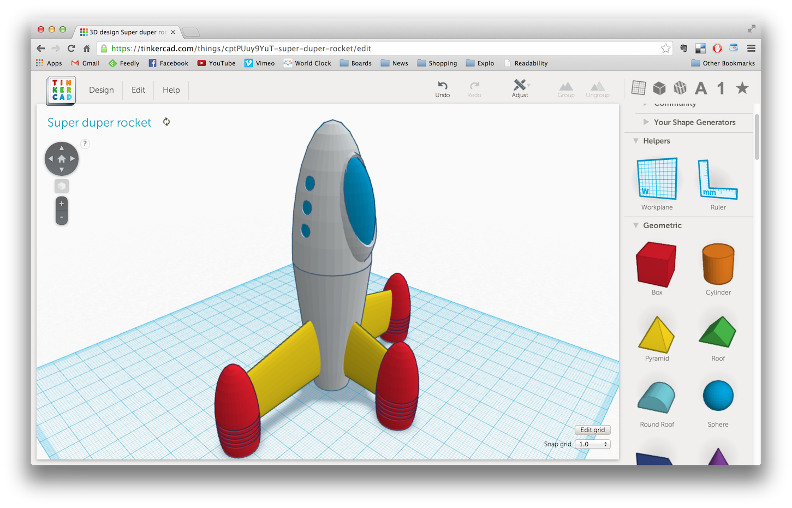

# [TinkerCad](https://www.tinkercad.com/)

* Herramienta online gratuita
* Necesita crearse una cuenta
* Al entrar encontramos tutoriales sencillos
* Interface:
  * Plano de trabajo
    * Podemos cambiar el plano de trabajo y así todo lo que hagamos se referirá al nuevo
  * A la derecha las paletas:
    * Geometrías  
    * Letras, Números y símbolos
    * Favoritos
    * Extras
    * Podemos importar modelos STLs
    * Usar los Generadores de Formas: Hay muchísimos!!!
    * Componentes
    * ¡¡Huecos!!
  * ¡¡Tiene deshacer!!
  * Sobre una pieza podemos girar, mover, cambiar de tamaño, según selecciones los distintos puntos o flechas
  * Si tenemos varias piezas podemos
      * Alinearlas
      * Agruparlas
  * En propiedades podemos cambiar el nombre  
  * Usar la regla sobre un objeto y así modificar sus dimensiones o ángulos

## Uso en clase

[Ejemplo de curso de 3 sesiones](Desarrollo_clases.md)

# Tareas

1. Cabeza de Conejo (usando plano de trabajo)
1. Crear tubo (Cilindros centrados)
1. Hacer un dado
1. [Conversión 2D a 3D](2d-To-3D.md)

[Mini-Curso de TinkerCad](https://www.youtube.com/playlist?list=PLWFBhjhRekOCKjZvrtUG7M988SZfh9TkJ)

# TODO

* Uso de codeblocks

https://www.instructables.com/Fraction-Action-With-Coding/

* Ejemplo de arreglos sencillos

https://www.instructables.com/Silly-Repairs-and-Improvements-Using-Tinkercad/

## Trucos y teclas

https://weareprintlab.com/blog/5-tinkercad-shortcuts-you-need-to-know

## Tutoriales

https://caractermaker.es/category/diseno-3d/
